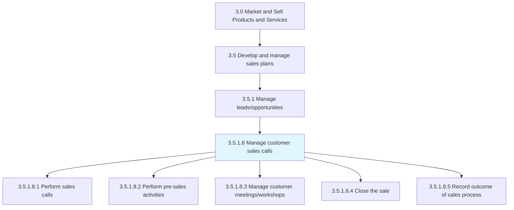
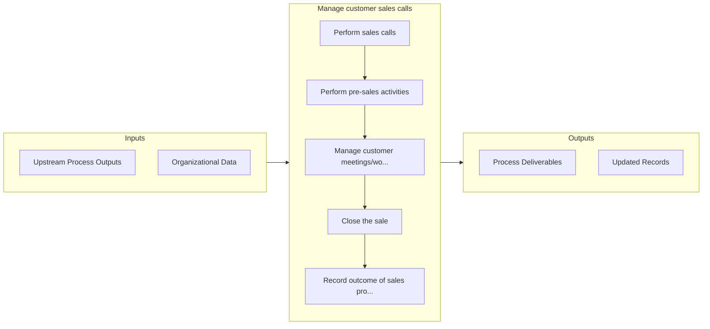

# Manage customer sales calls

> Managing the entire sales process, from using leads to open sales to closing sales and creating records.

## Overview

Activity 3.5.1.8 is an activity within the Market and Sell Products and Services framework. 

Managing the entire sales process, from using leads to open sales to closing sales and creating records. Govern all sales activities. Make sales calls based on leads and preparatory work (drafting terms of the sale, creating proposals, suggesting prices, etc.). Close the sale, along with any administrative activities related to data entry and the processing of the sale.

## Process Hierarchy



## Key Statistics

| Metric | Value |
|--------|-------|
| APQC Code | 10184 |
| Hierarchy ID | 3.5.1.8 |
| Level | Activity |
| Parent | [3.5.1](../) |
| Sub-Processes | 5 |


## GraphDL Semantic Structure

```
manage.CustomerSalesCalls
```

| Component | Value | Description |
|-----------|-------|-------------|
| Verb | `manage` | Primary action |
| Object | `customer sales calls` | Direct object |


## Process Flow



## Sub-Processes

| Process | Hierarchy ID | Description |
|---------|-------------|-------------|
| [Perform sales calls](./PerformSalesCalls) | 3.5.1.8.1 | Communicating with customers and prospects with the intent of creating sales opportunities |
| [Perform pre-sales activities](./PerformPresalesActivities) | 3.5.1.8.2 | Capitalizing on sales calls by pitching on bids and closing deals |
| [Manage customer meetings/workshops](./ManageCustomerMeetingsworkshops) | 3.5.1.8.3 | Arranging and leading meetings, seminars, workshops and training events with customers to educate th |
| [Close the sale](./CloseTheSale) | 3.5.1.8.4 | Formalizing a sale by reaching an agreement on terms of the deal |
| [Record outcome of sales process](./RecordOutcomeOfSalesProcess) | 3.5.1.8.5 | Completing all the paper-work associated with the sale of its products/services |


## Related Concepts

- [CustomerSalesCalls](/concepts/CustomerSalesCalls)


---

*Source: APQC PCF 10184 (3.5.1.8) - APQC*
