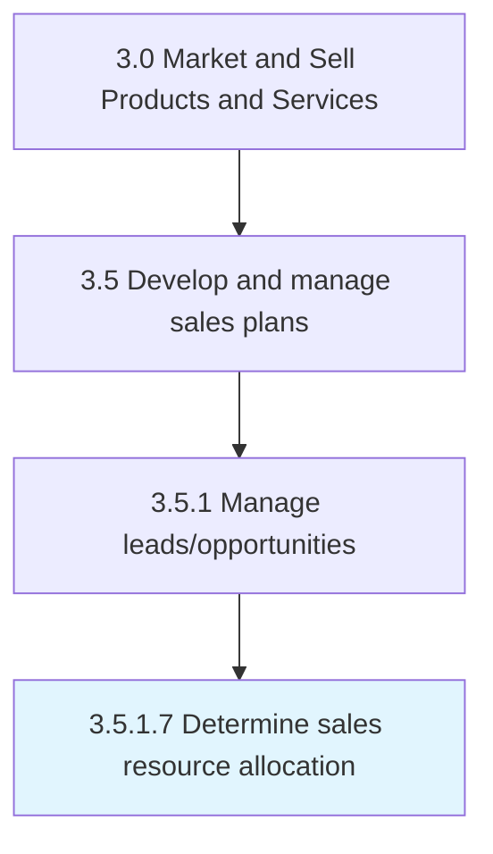

# Determine sales resource allocation

> Planning the distribution of personnel across various sales functions.

## Overview

Activity 3.5.1.7 is an activity within the Market and Sell Products and Services framework. 

Planning the distribution of personnel across various sales functions. Match the capabilities of individual employees with the skill sets needed for specific roles. Seek assistance from HR.

## Process Hierarchy



## Key Statistics

| Metric | Value |
|--------|-------|
| APQC Code | 10209 |
| Hierarchy ID | 3.5.1.7 |
| Level | Activity |
| Parent | [3.5.1](../) |
| Sub-Processes | 0 |


## GraphDL Semantic Structure

```
determine.SalesResourceAllocation
```

| Component | Value | Description |
|-----------|-------|-------------|
| Verb | `determine` | Primary action |
| Object | `sales resource allocation` | Direct object |


## Related Concepts

- [SalesResourceAllocation](/concepts/SalesResourceAllocation)


---

*Source: APQC PCF 10209 (3.5.1.7) - APQC*
