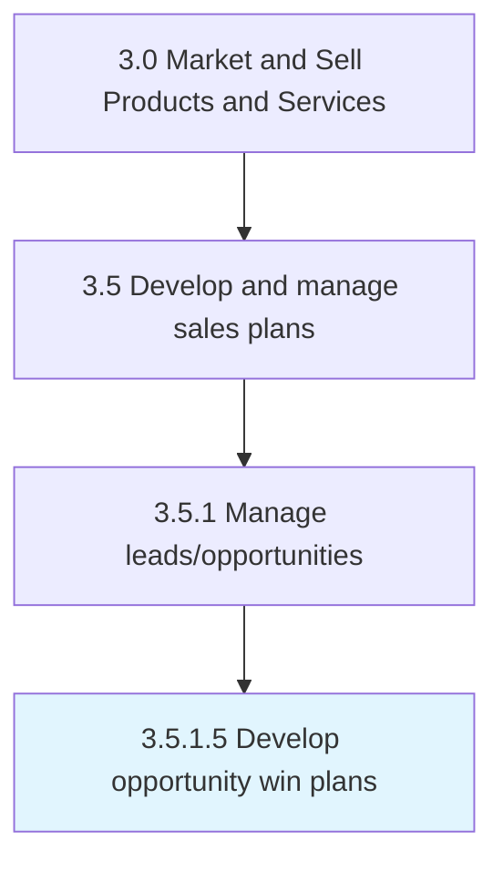

# Develop opportunity win plans

> Creating plans about how to close leads and win sales opportunities.

## Overview

Activity 3.5.1.5 is an activity within the Market and Sell Products and Services framework. 

Creating plans about how to close leads and win sales opportunities.

## Process Hierarchy



## Key Statistics

| Metric | Value |
|--------|-------|
| APQC Code | 18116 |
| Hierarchy ID | 3.5.1.5 |
| Level | Activity |
| Parent | [3.5.1](../) |
| Sub-Processes | 0 |


## GraphDL Semantic Structure

```
develop.OpportunityWinPlans
```

| Component | Value | Description |
|-----------|-------|-------------|
| Verb | `develop` | Primary action |
| Object | `opportunity win plans` | Direct object |


## Related Concepts

- [OpportunityWinPlans](/concepts/OpportunityWinPlans)


---

*Source: APQC PCF 18116 (3.5.1.5) - APQC*
