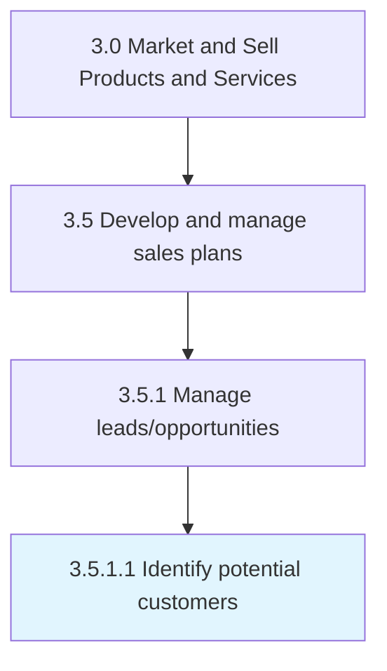

# Identify potential customers

> Identifying people who can be converted into customers.

## Overview

Activity 3.5.1.1 is an activity within the Market and Sell Products and Services framework. 

Identifying people who can be converted into customers. Leverage personal and professional networks, business research over databases and directories, and secondary research.

## Process Hierarchy



## Key Statistics

| Metric | Value |
|--------|-------|
| APQC Code | 10188 |
| Hierarchy ID | 3.5.1.1 |
| Level | Activity |
| Parent | [3.5.1](../) |
| Sub-Processes | 0 |


## GraphDL Semantic Structure

```
identify.PotentialCustomers
```

| Component | Value | Description |
|-----------|-------|-------------|
| Verb | `identify` | Primary action |
| Object | `potential customers` | Direct object |


## Related Concepts

- [PotentialCustomers](/concepts/PotentialCustomers)


---

*Source: APQC PCF 10188 (3.5.1.1) - APQC*
