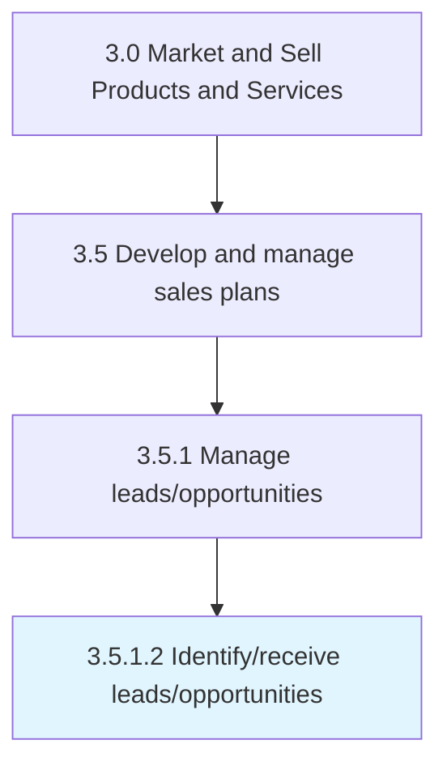
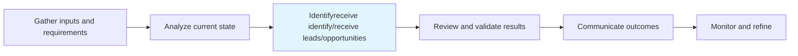

# Identify/receive leads/opportunities

> Qualifying the prospective customers into credible leads by gauging their behavior against the organization's offering.

## Overview

Activity 3.5.1.2 is an activity within the Market and Sell Products and Services framework.

Qualifying the prospective customers into credible leads by gauging their behavior against the organization's offering. Triangulate leads to increase the efficiency of sales and marketing efforts. Build a detailed profile of the prospects. Determine what products/services they already use, if they have decision-making authority, their views on the products/services they already use, how prone they are to switch, if the organization's solution better in some attributes than those prospects currently use, etc.

This process is critical to effective sales and marketing execution. It ensures that activities are systematically planned, executed, and measured against organizational objectives. When performed effectively, this process drives revenue growth, enhances customer engagement, and strengthens competitive positioning in target markets.

## Process Hierarchy

## Key Statistics

| Metric | Value |
|--------|-------|
| APQC Code | 10189 |
| Hierarchy ID | 3.5.1.2 |
| Level | Activity |
| Parent | [3.5.1](../) |
| Sub-Processes | 0 |

## Process Flow

## RACI Matrix

| Role | Responsible | Accountable | Consulted | Informed |
|------|:-----------:|:-----------:|:---------:|:--------:|
| Sales Representative | R |  |  |  |
| Sales Manager |  | A |  |  |
| Account Manager |  |  | C |  |
| Legal / Contracts |  |  | C |  |
| Executive Leadership |  |  |  | I |

## Related Occupations

- [Sales Managers](/occupations/Management/SalesManagers)
- [Sales Representatives Wholesale And Manufacturing](/occupations/Sales-and-Related/SalesRepresentativesWholesaleAndManufacturing)
- [Account Managers](/occupations/Sales-and-Related/AccountManagers)
- [Customer Service Representatives](/occupations/Office-and-Administrative-Support/CustomerServiceRepresentatives)
- [Business Development Managers](/occupations/Management/BusinessDevelopmentManagers)

## Related Departments

- [Sales](/departments/Sales)
- [Account Management](/departments/AccountManagement)
- [Customer Success](/departments/CustomerSuccess)

## Industry Variations

### Enterprise Software

In enterprise software, identify/receive leads/opportunities involves complex multi-stakeholder deal cycles, proof-of-concept demonstrations, and contract negotiation with procurement teams.

### Consumer Products

In consumer products, identify/receive leads/opportunities focuses on trade promotion management, retailer relationship development, and category captainship strategies.

### Professional Services

In professional services, identify/receive leads/opportunities centers on relationship-based selling, proposal development for complex engagements, and thought leadership positioning.

## KPIs & Metrics

| Metric | Description | Target |
|--------|-------------|--------|
| Win Rate | Percentage of qualified opportunities that result in closed deals | >30% |
| Average Deal Size | Average revenue per closed opportunity | Quarter-over-quarter growth |
| Sales Cycle Length | Average time from lead to closed deal | Below industry average |
| Customer Retention Rate | Percentage of customers retained year-over-year | >90% |

## Related Concepts

- Leads/Opportunities
- Leads/Opportunities

---

*Source: APQC PCF 10189 (3.5.1.2) - APQC*
