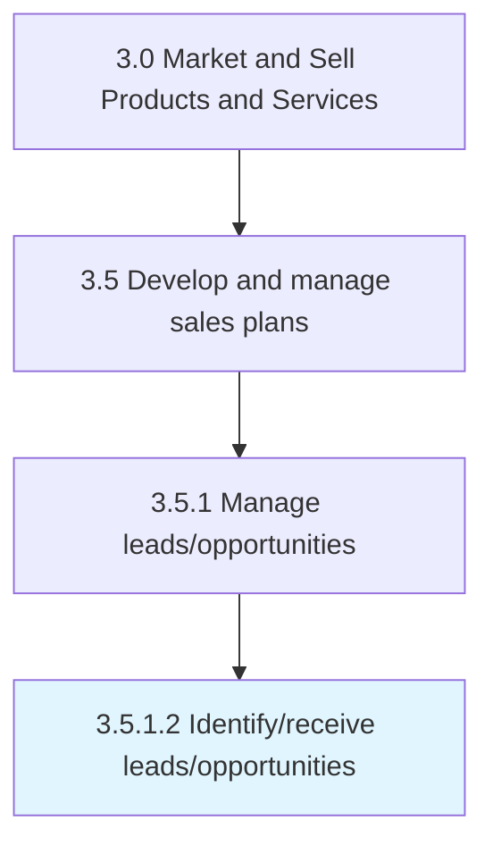

# Identify/receive leads/opportunities

> Qualifying the prospective customers into credible leads by gauging their behavior against the organization's offering.

## Overview

Activity 3.5.1.2 is an activity within the Market and Sell Products and Services framework. 

Qualifying the prospective customers into credible leads by gauging their behavior against the organization's offering. Triangulate leads to increase the efficiency of sales and marketing efforts. Build a detailed profile of the prospects. Determine what products/services they already use, if they have decision-making authority, their views on the products/services they already use, how prone they are to switch, if the organization's solution better in some attributes than those prospects currently use, etc.

## Process Hierarchy



## Key Statistics

| Metric | Value |
|--------|-------|
| APQC Code | 10189 |
| Hierarchy ID | 3.5.1.2 |
| Level | Activity |
| Parent | [3.5.1](../) |
| Sub-Processes | 0 |


## GraphDL Semantic Structure

```
identify/receive.Leadsopportunities
```

| Component | Value | Description |
|-----------|-------|-------------|
| Verb | `identify/receive` | Primary action |
| Object | `leads/opportunities` | Direct object |


## Related Concepts

- [Leads/Opportunities](/concepts/Leads/Opportunities)
- [Leads/Opportunities](/concepts/Leads/Opportunities)


---

*Source: APQC PCF 10189 (3.5.1.2) - APQC*
