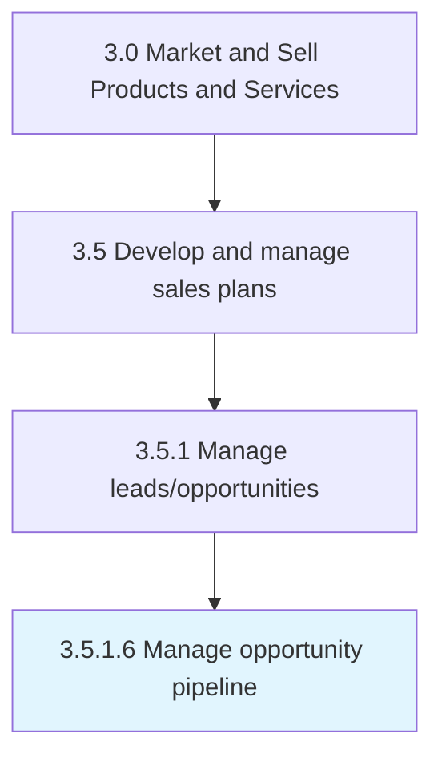

# Manage opportunity pipeline

> Overseeing and planning the acquisition of new customers.

## Overview

Activity 3.5.1.6 is an activity within the Market and Sell Products and Services framework. 

Overseeing and planning the acquisition of new customers.

## Process Hierarchy



## Key Statistics

| Metric | Value |
|--------|-------|
| APQC Code | 20011 |
| Hierarchy ID | 3.5.1.6 |
| Level | Activity |
| Parent | [3.5.1](../) |
| Sub-Processes | 0 |


## GraphDL Semantic Structure

```
manage.OpportunityPipeline
```

| Component | Value | Description |
|-----------|-------|-------------|
| Verb | `manage` | Primary action |
| Object | `opportunity pipeline` | Direct object |


## Related Concepts

- [OpportunityPipeline](/concepts/OpportunityPipeline)


---

*Source: APQC PCF 20011 (3.5.1.6) - APQC*
