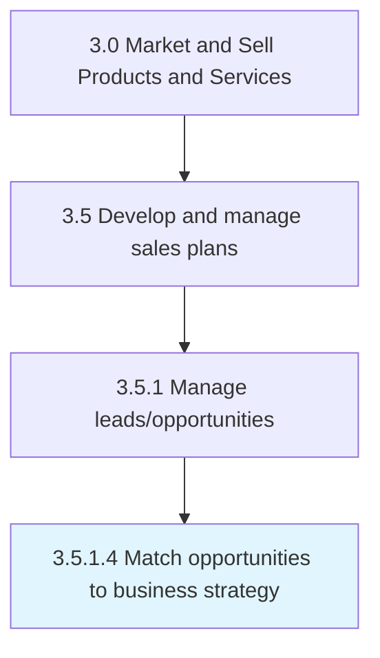

# Match opportunities to business strategy

> Aligning sales leads with business objectives.

## Overview

Activity 3.5.1.4 is an activity within the Market and Sell Products and Services framework. 

## Process Hierarchy



## Key Statistics

| Metric | Value |
|--------|-------|
| APQC Code | 11773 |
| Hierarchy ID | 3.5.1.4 |
| Level | Activity |
| Parent | [3.5.1](../) |
| Sub-Processes | 0 |


## GraphDL Semantic Structure

```
match.Opportunities.to.BusinessStrategy
```

| Component | Value | Description |
|-----------|-------|-------------|
| Verb | `match` | Primary action |
| Object | `opportunities` | Direct object |
| Preposition | `to` | Relationship |
| PrepObject | `business strategy` | Indirect object |


## Related Concepts

- Opportunities
- BusinessStrategy


---

*Source: APQC PCF 11773 (3.5.1.4) - APQC*
