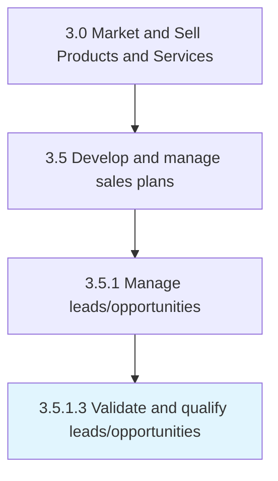

# Validate and qualify leads/opportunities

> Reviewing the set of potential customers and sales opportunities.

## Overview

Activity 3.5.1.3 is an activity within the Market and Sell Products and Services framework. 

Reviewing the set of potential customers and sales opportunities. Approve the leads that meet company requirements on new businesses.

## Process Hierarchy



## Key Statistics

| Metric | Value |
|--------|-------|
| APQC Code | 18115 |
| Hierarchy ID | 3.5.1.3 |
| Level | Activity |
| Parent | [3.5.1](../) |
| Sub-Processes | 0 |


## GraphDL Semantic Structure

```
validate.AndQualifyLeadsopportunities
```

| Component | Value | Description |
|-----------|-------|-------------|
| Verb | `validate` | Primary action |
| Object | `and qualify leads/opportunities` | Direct object |


## Related Concepts

- Leads
- Opportunities
- Leads
- Opportunities


---

*Source: APQC PCF 18115 (3.5.1.3) - APQC*
