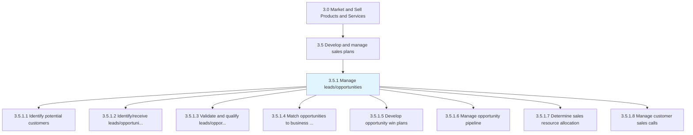
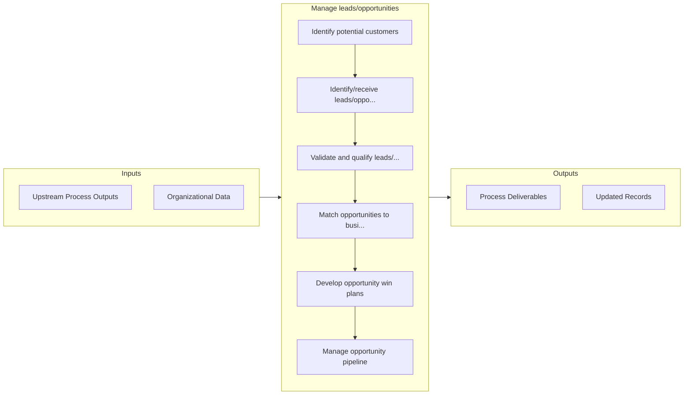

# Manage leads/opportunities

> Generating leads of prospective customers to grow the organization's business.

## Overview

Process 3.5.1 is a core process that defines the specific procedures for manage leads/opportunities. 

Generating leads of prospective customers to grow the organization's business. Identify viable customers based on customer and market research. Discover leads through IT applications, cold calling, reference/network development, or other sales and business development techniques. Employ a scoring model qualify the prospective customers into leads, and prioritize them.

## Process Hierarchy



## Key Statistics

| Metric | Value |
|--------|-------|
| APQC Code | 10182 |
| Hierarchy ID | 3.5.1 |
| Level | Process |
| Parent | [3.5](../) |
| Sub-Processes | 8 |


## GraphDL Semantic Structure

```
manage.Leadsopportunities
```

| Component | Value | Description |
|-----------|-------|-------------|
| Verb | `manage` | Primary action |
| Object | `leads/opportunities` | Direct object |


## Process Flow



## Sub-Processes

| Process | Hierarchy ID | Description |
|---------|-------------|-------------|
| [Identify potential customers](./IdentifyPotentialCustomers) | 3.5.1.1 | Identifying people who can be converted into customers |
| [Identify/receive leads/opportunities](./IdentifyreceiveLeadsopportunities) | 3.5.1.2 | Qualifying the prospective customers into credible leads by gauging their behavior against the organ |
| [Validate and qualify leads/opportunities](./ValidateAndQualifyLeadsopportunities) | 3.5.1.3 | Reviewing the set of potential customers and sales opportunities |
| [Match opportunities to business strategy](./MatchOpportunitiesToBusinessStrategy) | 3.5.1.4 | Aligning sales leads with business objectives |
| [Develop opportunity win plans](./DevelopOpportunityWinPlans) | 3.5.1.5 | Creating plans about how to close leads and win sales opportunities |
| [Manage opportunity pipeline](./ManageOpportunityPipeline) | 3.5.1.6 | Overseeing and planning the acquisition of new customers |
| [Determine sales resource allocation](./DetermineSalesResourceAllocation) | 3.5.1.7 | Planning the distribution of personnel across various sales functions |
| [Manage customer sales calls](./3.5.1.8-ManageCustomerSalesCalls/) | 3.5.1.8 | Managing the entire sales process, from using leads to open sales to closing sales and creating reco |


## Related Concepts

- Leads
- Opportunities


---

*Source: APQC PCF 10182 (3.5.1) - APQC*
