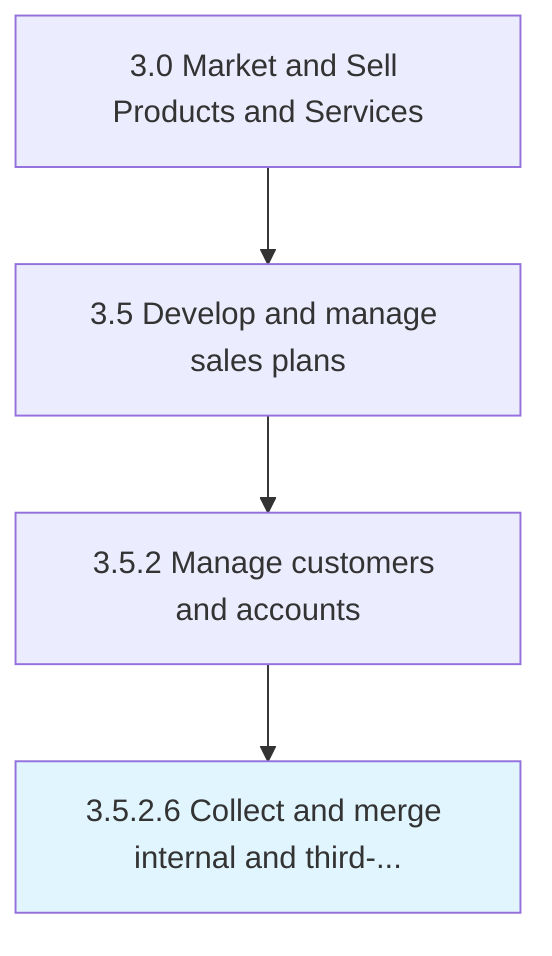

# Collect and merge internal and third-party customer information

> Gathering the data about customers.

## Overview

Activity 3.5.2.6 is an activity within the Market and Sell Products and Services framework. 

Gathering the data about customers. Combine the information available locally with the data obtained from external sources.

## Process Hierarchy



## Key Statistics

| Metric | Value |
|--------|-------|
| APQC Code | 16598 |
| Hierarchy ID | 3.5.2.6 |
| Level | Activity |
| Parent | [3.5.2](../) |
| Sub-Processes | 0 |


## GraphDL Semantic Structure

```
collect.AndMergeInternalAndThirdpartyCustomerInformation
```

| Component | Value | Description |
|-----------|-------|-------------|
| Verb | `collect` | Primary action |
| Object | `and merge internal and third-party customer information` | Direct object |


---

*Source: APQC PCF 16598 (3.5.2.6) - APQC*
