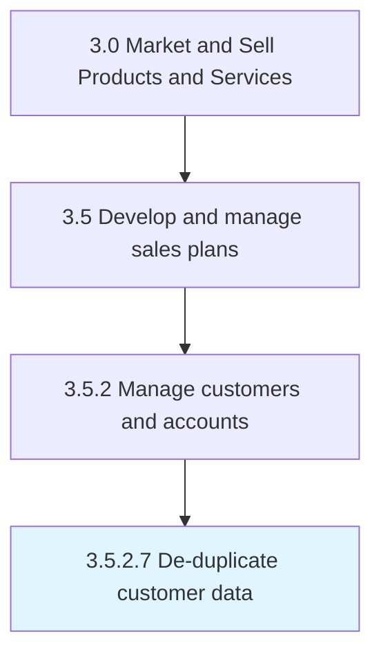

# De-duplicate customer data

> Eliminating redundant information in customer data.

## Overview

Activity 3.5.2.7 is an activity within the Market and Sell Products and Services framework. 

Eliminating redundant information in customer data.

## Process Hierarchy



## Key Statistics

| Metric | Value |
|--------|-------|
| APQC Code | 16599 |
| Hierarchy ID | 3.5.2.7 |
| Level | Activity |
| Parent | [3.5.2](../) |
| Sub-Processes | 0 |


## GraphDL Semantic Structure

```
de-duplicate.CustomerData
```

| Component | Value | Description |
|-----------|-------|-------------|
| Verb | `de-duplicate` | Primary action |
| Object | `customer data` | Direct object |


---

*Source: APQC PCF 16599 (3.5.2.7) - APQC*
