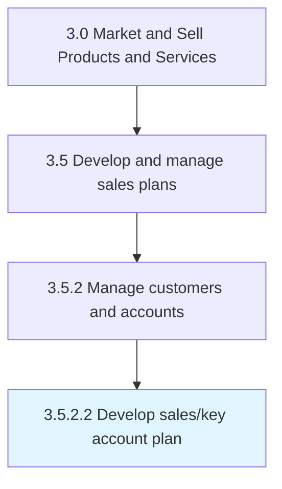

# Develop sales/key account plan

> Creating a plan for managing the accounts of key customers in order to better maintain relationships with them.

## Overview

Activity 3.5.2.2 is an activity within the Market and Sell Products and Services framework. 

Creating a plan for managing the accounts of key customers in order to better maintain relationships with them. Chart a scheme for managing sales. Create a plan for administering accounts of the significant and most important customers of the organization. Coordinate the accounts of principal clients.

## Process Hierarchy



## Key Statistics

| Metric | Value |
|--------|-------|
| APQC Code | 11173 |
| Hierarchy ID | 3.5.2.2 |
| Level | Activity |
| Parent | [3.5.2](../) |
| Sub-Processes | 0 |


## GraphDL Semantic Structure

```
develop.SaleskeyAccountPlan
```

| Component | Value | Description |
|-----------|-------|-------------|
| Verb | `develop` | Primary action |
| Object | `sales/key account plan` | Direct object |


## Related Concepts

- [SalesAccountPlan](/concepts/SalesAccountPlan)
- [KeyAccountPlan](/concepts/KeyAccountPlan)


---

*Source: APQC PCF 11173 (3.5.2.2) - APQC*
