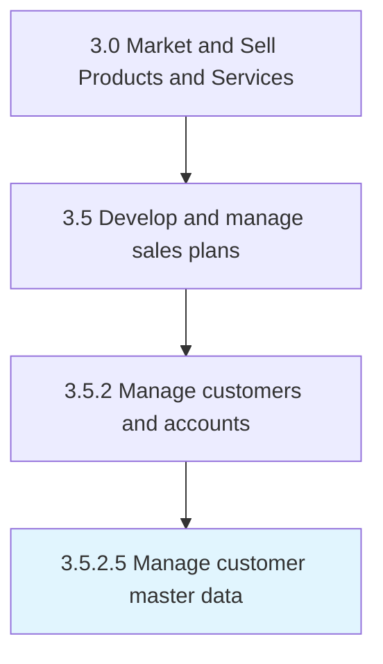

# Manage customer master data

> Managing the corpus of data relating all customers acquired over time.

## Overview

Activity 3.5.2.5 is an activity within the Market and Sell Products and Services framework. 

Managing the corpus of data relating all customers acquired over time. Manage the storage, maintenance, access, revision, and usage of all data on customers. Ensure its security, and determine legitimate use cases that are beneficial to the organization.

## Process Hierarchy



## Key Statistics

| Metric | Value |
|--------|-------|
| APQC Code | 14208 |
| Hierarchy ID | 3.5.2.5 |
| Level | Activity |
| Parent | [3.5.2](../) |
| Sub-Processes | 0 |


## GraphDL Semantic Structure

```
manage.CustomerMasterData
```

| Component | Value | Description |
|-----------|-------|-------------|
| Verb | `manage` | Primary action |
| Object | `customer master data` | Direct object |


## Related Concepts

- [CustomerMasterData](/concepts/CustomerMasterData)


---

*Source: APQC PCF 14208 (3.5.2.5) - APQC*
