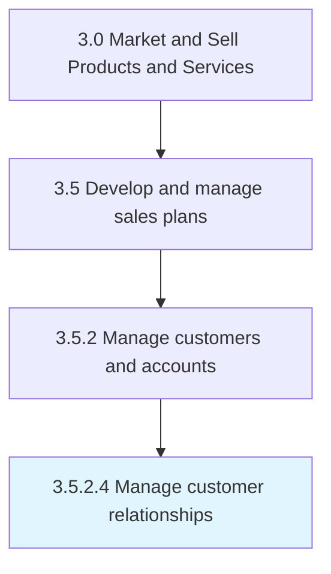

# Manage customer relationships

> Managing the organization's relationship with its customers, by systematically coordinating interactions over multiple touch points, on a regular basis.

## Overview

Activity 3.5.2.4 is an activity within the Market and Sell Products and Services framework. 

Managing the organization's relationship with its customers, by systematically coordinating interactions over multiple touch points, on a regular basis. Coordinate the organization's efforts to reach out to its customers. Create and manage effective touch points for interactions from the customers, which could include emails, social-media interactions, newsletters, and direct conversations.

## Process Hierarchy



## Key Statistics

| Metric | Value |
|--------|-------|
| APQC Code | 11174 |
| Hierarchy ID | 3.5.2.4 |
| Level | Activity |
| Parent | [3.5.2](../) |
| Sub-Processes | 0 |


## GraphDL Semantic Structure

```
manage.CustomerRelationships
```

| Component | Value | Description |
|-----------|-------|-------------|
| Verb | `manage` | Primary action |
| Object | `customer relationships` | Direct object |


## Related Concepts

- [CustomerRelationships](/concepts/CustomerRelationships)


---

*Source: APQC PCF 11174 (3.5.2.4) - APQC*
