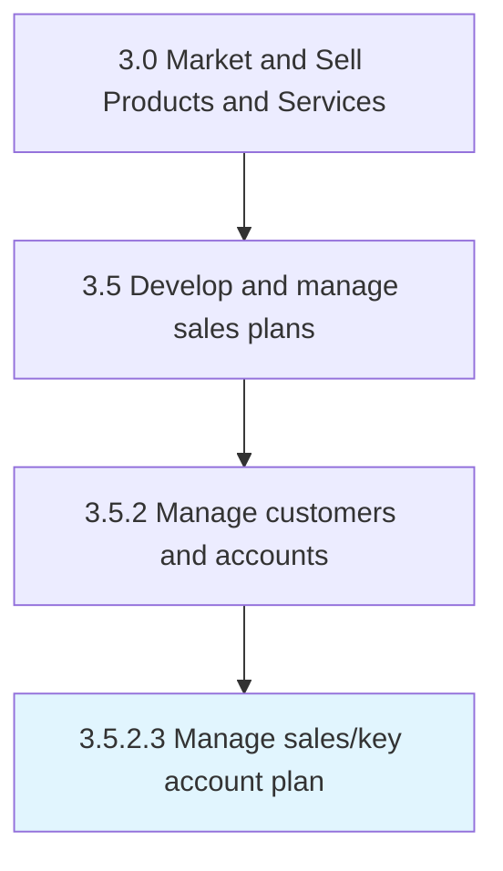

# Manage sales/key account plan

> Handling the accounts of important clients.

## Overview

Activity 3.5.2.3 is an activity within the Market and Sell Products and Services framework. 

## Process Hierarchy



## Key Statistics

| Metric | Value |
|--------|-------|
| APQC Code | 20014 |
| Hierarchy ID | 3.5.2.3 |
| Level | Activity |
| Parent | [3.5.2](../) |
| Sub-Processes | 0 |


## GraphDL Semantic Structure

```
manage.SaleskeyAccountPlan
```

| Component | Value | Description |
|-----------|-------|-------------|
| Verb | `manage` | Primary action |
| Object | `sales/key account plan` | Direct object |


## Related Concepts

- [SalesAccountPlan](/concepts/SalesAccountPlan)
- [KeyAccountPlan](/concepts/KeyAccountPlan)


---

*Source: APQC PCF 20014 (3.5.2.3) - APQC*
