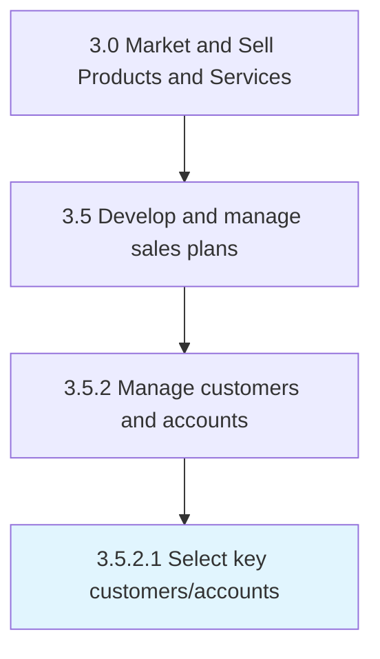

# Select key customers/accounts

> Choosing principal clients that are vital for the company.

## Overview

Activity 3.5.2.1 is an activity within the Market and Sell Products and Services framework. 

Choosing principal clients that are vital for the company.

## Process Hierarchy



## Key Statistics

| Metric | Value |
|--------|-------|
| APQC Code | 20013 |
| Hierarchy ID | 3.5.2.1 |
| Level | Activity |
| Parent | [3.5.2](../) |
| Sub-Processes | 0 |


## GraphDL Semantic Structure

```
select.KeyCustomersaccounts
```

| Component | Value | Description |
|-----------|-------|-------------|
| Verb | `select` | Primary action |
| Object | `key customers/accounts` | Direct object |


## Related Concepts

- [KeyCustomers](/concepts/KeyCustomers)
- [KeyAccounts](/concepts/KeyAccounts)


---

*Source: APQC PCF 20013 (3.5.2.1) - APQC*
