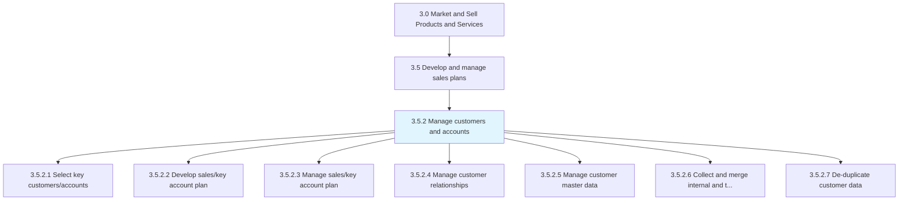
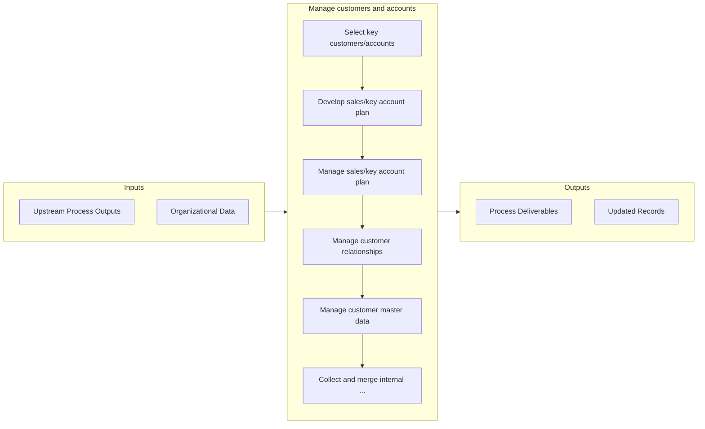

# Manage customers and accounts

> Managing the customer's expectations, with the intent of responsibly increasing the sale of the organization's products/services.

## Overview

Process 3.5.2 is a core process that defines the specific procedures for manage customers and accounts. 

Managing the customer's expectations, with the intent of responsibly increasing the sale of the organization's products/services. Create a systematic method for governing sales, using sales forecasts and customer management measures. Develop a blueprint to manage relationships with customers and the data it holds on them, as well as the sale of its products/services to these customers. Devise a recipe for handling the organization's key customers in order to manage their expectations with tact and responsibility while maximizing revenue.

## Process Hierarchy



## Key Statistics

| Metric | Value |
|--------|-------|
| APQC Code | 10183 |
| Hierarchy ID | 3.5.2 |
| Level | Process |
| Parent | [3.5](../) |
| Sub-Processes | 7 |


## GraphDL Semantic Structure

```graphdl
manage.CustomersAndAccounts
```

| Component | Value | Description |
|-----------|-------|-------------|
| Verb | `manage` | Primary action |
| Object | `customers and accounts` | Direct object |


## Process Flow



## Sub-Processes

| Process | Hierarchy ID | Description |
|---------|-------------|-------------|
| [Select key customers/accounts](./SelectKeyCustomersaccounts) | 3.5.2.1 | Choosing principal clients that are vital for the company |
| [Develop sales/key account plan](./DevelopSaleskeyAccountPlan) | 3.5.2.2 | Creating a plan for managing the accounts of key customers in order to better maintain relationships |
| [Manage sales/key account plan](./ManageSaleskeyAccountPlan) | 3.5.2.3 | Handling the accounts of important clients |
| [Manage customer relationships](./ManageCustomerRelationships) | 3.5.2.4 | Managing the organization's relationship with its customers, by systematically coordinating interact |
| [Manage customer master data](./ManageCustomerMasterData) | 3.5.2.5 | Managing the corpus of data relating all customers acquired over time |
| [Collect and merge internal and third-party customer information](./CollectAndMergeInternalAndThirdpartyCustomerInformation) | 3.5.2.6 | Gathering the data about customers |
| [De-duplicate customer data](./DeduplicateCustomerData) | 3.5.2.7 | Eliminating redundant information in customer data |


## Related Concepts

- Customers
- Accounts


---

*Source: APQC PCF 10183 (3.5.2) - APQC*
