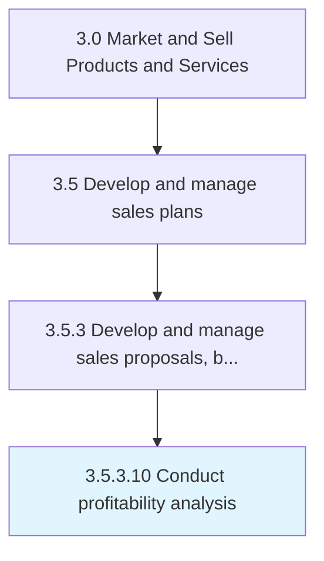

# Conduct profitability analysis

> Reviewing profitability data.

## Overview

Activity 3.5.3.10 is an activity within the Market and Sell Products and Services framework. 

Reviewing profitability data. Analyze systematically all relevant metrics and parameters. Report findings and make recommendations for changes to operational strategies.

## Process Hierarchy



## Key Statistics

| Metric | Value |
|--------|-------|
| APQC Code | 11789 |
| Hierarchy ID | 3.5.3.10 |
| Level | Activity |
| Parent | [3.5.3](../) |
| Sub-Processes | 0 |


## GraphDL Semantic Structure

```
conduct.ProfitabilityAnalysis
```

| Component | Value | Description |
|-----------|-------|-------------|
| Verb | `conduct` | Primary action |
| Object | `profitability analysis` | Direct object |


## Related Concepts

- ProfitabilityAnalysis


---

*Source: APQC PCF 11789 (3.5.3.10) - APQC*
