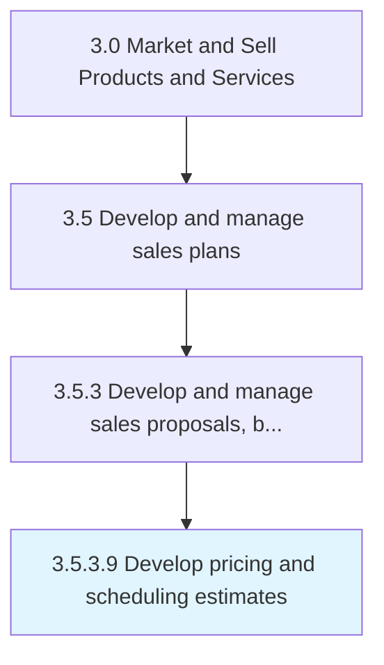

# Develop pricing and scheduling estimates

> Establishing predicted delivery costs, fees and timelines.

## Overview

Activity 3.5.3.9 is an activity within the Market and Sell Products and Services framework. 

Establishing predicted delivery costs, fees and timelines.

## Process Hierarchy



## Key Statistics

| Metric | Value |
|--------|-------|
| APQC Code | 11788 |
| Hierarchy ID | 3.5.3.9 |
| Level | Activity |
| Parent | [3.5.3](../) |
| Sub-Processes | 0 |


## GraphDL Semantic Structure

```
develop.PricingAndSchedulingEstimates
```

| Component | Value | Description |
|-----------|-------|-------------|
| Verb | `develop` | Primary action |
| Object | `pricing and scheduling estimates` | Direct object |


## Related Concepts

- PricingEstimates
- SchedulingEstimates


---

*Source: APQC PCF 11788 (3.5.3.9) - APQC*
