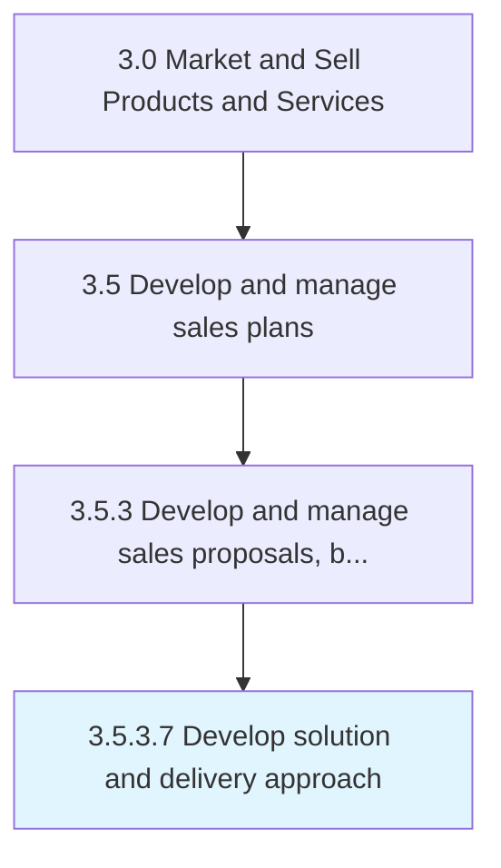

# Develop solution and delivery approach

> Creating a plan with detailed steps about how produce and deliver the goods or services.

## Overview

Activity 3.5.3.7 is an activity within the Market and Sell Products and Services framework. 

Creating a plan with detailed steps about how produce and deliver the goods or services.

## Process Hierarchy



## Key Statistics

| Metric | Value |
|--------|-------|
| APQC Code | 20015 |
| Hierarchy ID | 3.5.3.7 |
| Level | Activity |
| Parent | [3.5.3](../) |
| Sub-Processes | 0 |


## GraphDL Semantic Structure

```
develop.SolutionAndDeliveryApproach
```

| Component | Value | Description |
|-----------|-------|-------------|
| Verb | `develop` | Primary action |
| Object | `solution and delivery approach` | Direct object |


## Related Concepts

- SolutionApproach
- DeliveryApproach


---

*Source: APQC PCF 20015 (3.5.3.7) - APQC*
