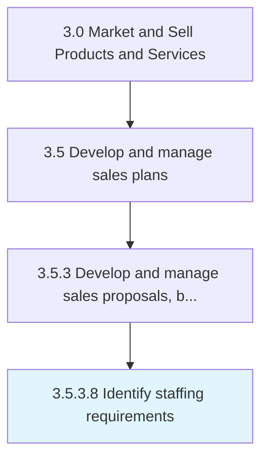

# Identify staffing requirements

> Determining the needs for internal resources and vacancies.

## Overview

Activity 3.5.3.8 is an activity within the Market and Sell Products and Services framework. 

Determining the needs for internal resources and vacancies.

## Process Hierarchy



## Key Statistics

| Metric | Value |
|--------|-------|
| APQC Code | 11787 |
| Hierarchy ID | 3.5.3.8 |
| Level | Activity |
| Parent | [3.5.3](../) |
| Sub-Processes | 0 |


## GraphDL Semantic Structure

```
identify.StaffingRequirements
```

| Component | Value | Description |
|-----------|-------|-------------|
| Verb | `identify` | Primary action |
| Object | `staffing requirements` | Direct object |


## Related Concepts

- StaffingRequirements


---

*Source: APQC PCF 11787 (3.5.3.8) - APQC*
