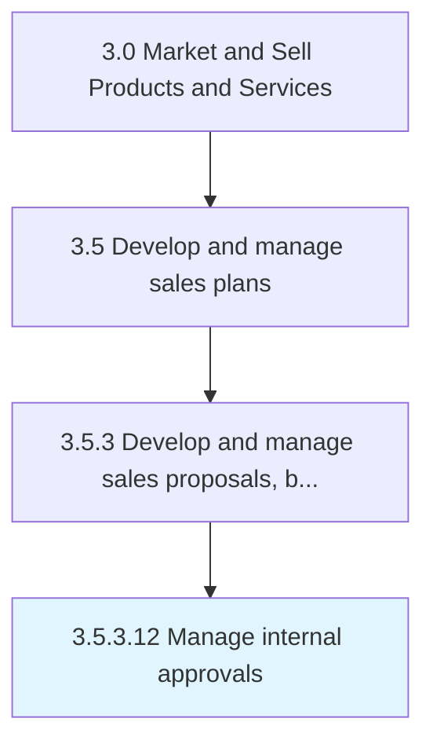

# Manage internal approvals

> Obtaining required company-internal authorizations.

## Overview

Activity 3.5.3.12 is an activity within the Market and Sell Products and Services framework. 

Obtaining required company-internal authorizations.

## Process Hierarchy



## Key Statistics

| Metric | Value |
|--------|-------|
| APQC Code | 20017 |
| Hierarchy ID | 3.5.3.12 |
| Level | Activity |
| Parent | [3.5.3](../) |
| Sub-Processes | 0 |


## GraphDL Semantic Structure

```
manage.InternalApprovals
```

| Component | Value | Description |
|-----------|-------|-------------|
| Verb | `manage` | Primary action |
| Object | `internal approvals` | Direct object |


## Related Concepts

- [InternalApprovals](/concepts/InternalApprovals)


---

*Source: APQC PCF 20017 (3.5.3.12) - APQC*
