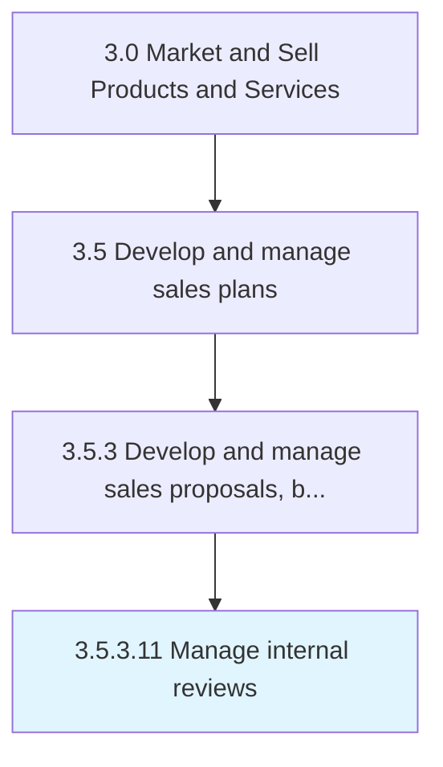

# Manage internal reviews

> Overseeing the internal review process.

## Overview

Activity 3.5.3.11 is an activity within the Market and Sell Products and Services framework. 

## Process Hierarchy



## Key Statistics

| Metric | Value |
|--------|-------|
| APQC Code | 20016 |
| Hierarchy ID | 3.5.3.11 |
| Level | Activity |
| Parent | [3.5.3](../) |
| Sub-Processes | 0 |


## GraphDL Semantic Structure

```
manage.InternalReviews
```

| Component | Value | Description |
|-----------|-------|-------------|
| Verb | `manage` | Primary action |
| Object | `internal reviews` | Direct object |


## Related Concepts

- InternalReviews


---

*Source: APQC PCF 20016 (3.5.3.11) - APQC*
