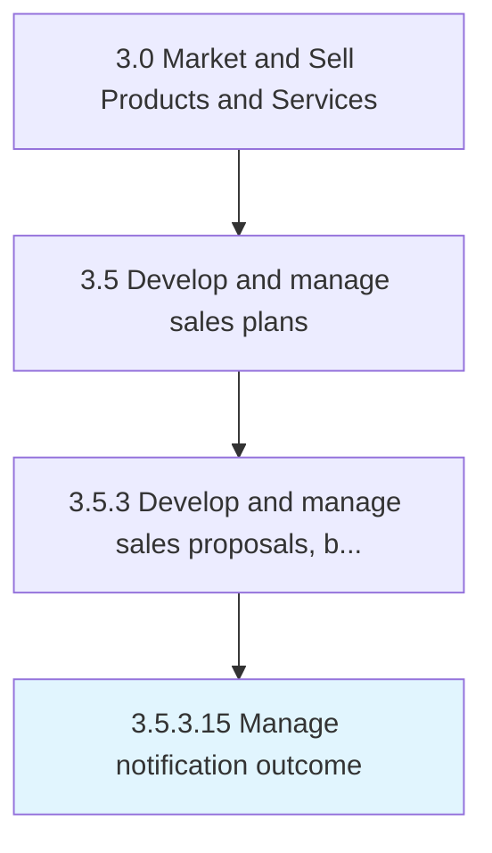

# Manage notification outcome

> Handling proposals depending on whether they were accepted or rejected.

## Overview

Activity 3.5.3.15 is an activity within the Market and Sell Products and Services framework. 

Handling proposals depending on whether they were accepted or rejected.

## Process Hierarchy



## Key Statistics

| Metric | Value |
|--------|-------|
| APQC Code | 11793 |
| Hierarchy ID | 3.5.3.15 |
| Level | Activity |
| Parent | [3.5.3](../) |
| Sub-Processes | 0 |


## GraphDL Semantic Structure

```
manage.NotificationOutcome
```

| Component | Value | Description |
|-----------|-------|-------------|
| Verb | `manage` | Primary action |
| Object | `notification outcome` | Direct object |


## Related Concepts

- NotificationOutcome


---

*Source: APQC PCF 11793 (3.5.3.15) - APQC*
