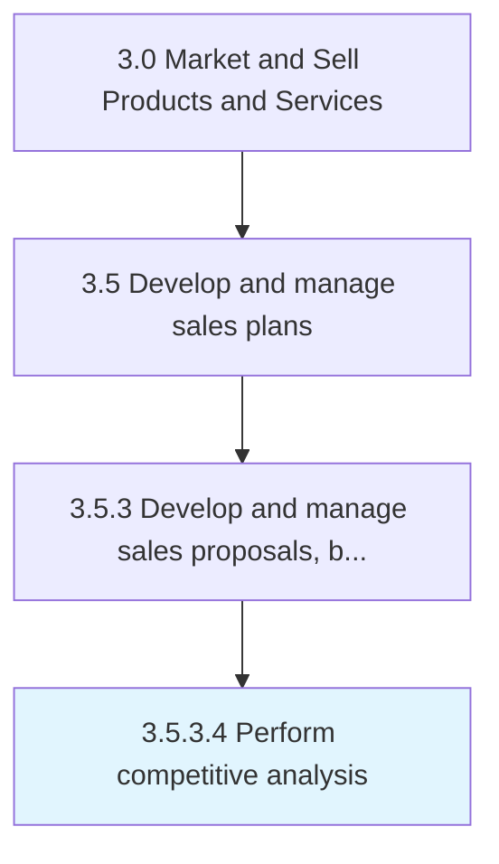

# Perform competitive analysis

> Comparing the proposals submitted by different bidders in terms of cost, efficiency and value.

## Overview

Activity 3.5.3.4 is an activity within the Market and Sell Products and Services framework. 

Comparing the proposals submitted by different bidders in terms of cost, efficiency and value.

## Process Hierarchy



## Key Statistics

| Metric | Value |
|--------|-------|
| APQC Code | 11783 |
| Hierarchy ID | 3.5.3.4 |
| Level | Activity |
| Parent | [3.5.3](../) |
| Sub-Processes | 0 |


## GraphDL Semantic Structure

```
perform.CompetitiveAnalysis
```

| Component | Value | Description |
|-----------|-------|-------------|
| Verb | `perform` | Primary action |
| Object | `competitive analysis` | Direct object |


## Related Concepts

- [CompetitiveAnalysis](/concepts/CompetitiveAnalysis)


---

*Source: APQC PCF 11783 (3.5.3.4) - APQC*
