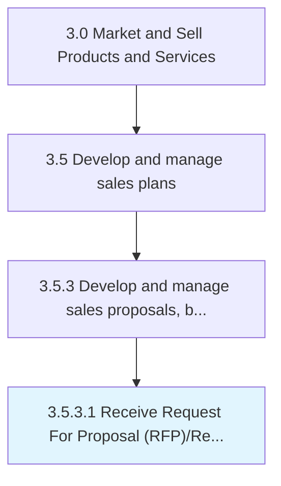

# Receive Request For Proposal (RFP)/Request For Quote (RFQ)

> Accepting procurement proposals.

## Overview

Activity 3.5.3.1 is an activity within the Market and Sell Products and Services framework. 

## Process Hierarchy



## Key Statistics

| Metric | Value |
|--------|-------|
| APQC Code | 11781 |
| Hierarchy ID | 3.5.3.1 |
| Level | Activity |
| Parent | [3.5.3](../) |
| Sub-Processes | 0 |


## GraphDL Semantic Structure

```
receive.Request.for.ProposalRFPRequestForQuoteRFQ
```

| Component | Value | Description |
|-----------|-------|-------------|
| Verb | `receive` | Primary action |
| Object | `Request` | Direct object |
| Preposition | `for` | Relationship |
| PrepObject | `Proposal (RFP)/Request For Quote (RFQ)` | Indirect object |


---

*Source: APQC PCF 11781 (3.5.3.1) - APQC*
