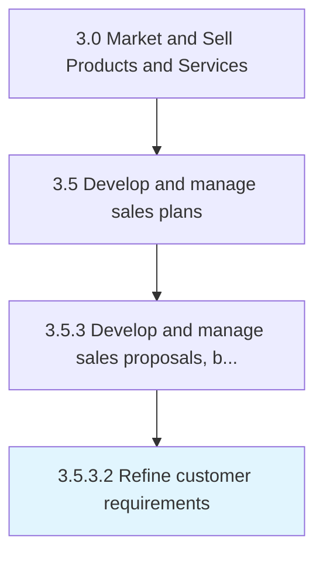

# Refine customer requirements

> Clarifying the details about procurement requests, such as the scope, timeline, data sources, type and characteristics and evaluation criteria for the goods or services to be delivered, and any additional terms, conditions or special requirements.

## Overview

Activity 3.5.3.2 is an activity within the Market and Sell Products and Services framework. 

Clarifying the details about procurement requests, such as the scope, timeline, data sources, type and characteristics and evaluation criteria for the goods or services to be delivered, and any additional terms, conditions or special requirements.

## Process Hierarchy



## Key Statistics

| Metric | Value |
|--------|-------|
| APQC Code | 11780 |
| Hierarchy ID | 3.5.3.2 |
| Level | Activity |
| Parent | [3.5.3](../) |
| Sub-Processes | 0 |


## GraphDL Semantic Structure

```
refine.CustomerRequirements
```

| Component | Value | Description |
|-----------|-------|-------------|
| Verb | `refine` | Primary action |
| Object | `customer requirements` | Direct object |


## Related Concepts

- CustomerRequirements


---

*Source: APQC PCF 11780 (3.5.3.2) - APQC*
