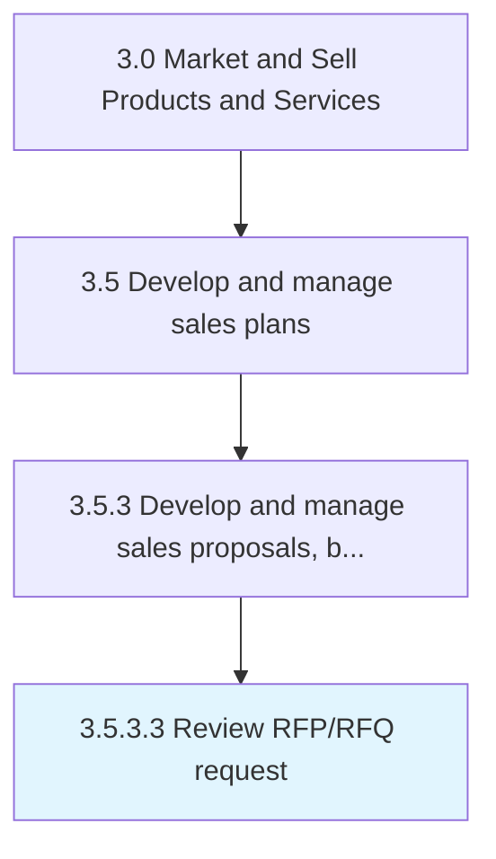

# Review RFP/RFQ request

> Evaluating individual price and delivery solicitations for their strengths and weaknesses.

## Overview

Activity 3.5.3.3 is an activity within the Market and Sell Products and Services framework. 

Evaluating individual price and delivery solicitations for their strengths and weaknesses. Analyze how closely the submitted bids respond to the requirements outlined in the RFPs.

## Process Hierarchy



## Key Statistics

| Metric | Value |
|--------|-------|
| APQC Code | 11782 |
| Hierarchy ID | 3.5.3.3 |
| Level | Activity |
| Parent | [3.5.3](../) |
| Sub-Processes | 0 |


## GraphDL Semantic Structure

```
review.RFPRFQRequest
```

| Component | Value | Description |
|-----------|-------|-------------|
| Verb | `review` | Primary action |
| Object | `RFP/RFQ request` | Direct object |


## Related Concepts

- RFPRequest
- RFQRequest


---

*Source: APQC PCF 11782 (3.5.3.3) - APQC*
