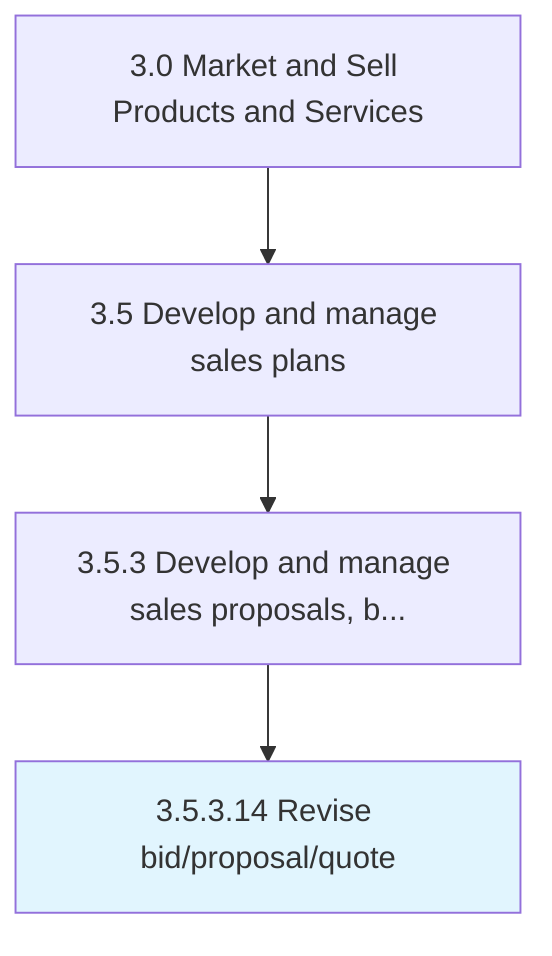

# Revise bid/proposal/quote

> Amending bids, proposals or quotes with more accurate time, cost or delivery estimates.

## Overview

Activity 3.5.3.14 is an activity within the Market and Sell Products and Services framework. 

Amending bids, proposals or quotes with more accurate time, cost or delivery estimates.

## Process Hierarchy



## Key Statistics

| Metric | Value |
|--------|-------|
| APQC Code | 20018 |
| Hierarchy ID | 3.5.3.14 |
| Level | Activity |
| Parent | [3.5.3](../) |
| Sub-Processes | 0 |


## GraphDL Semantic Structure

```
revise.Bidproposalquote
```

| Component | Value | Description |
|-----------|-------|-------------|
| Verb | `revise` | Primary action |
| Object | `bid/proposal/quote` | Direct object |


## Related Concepts

- [Bid](/concepts/Bid)
- [Proposal](/concepts/Proposal)
- [Quote](/concepts/Quote)


---

*Source: APQC PCF 20018 (3.5.3.14) - APQC*
