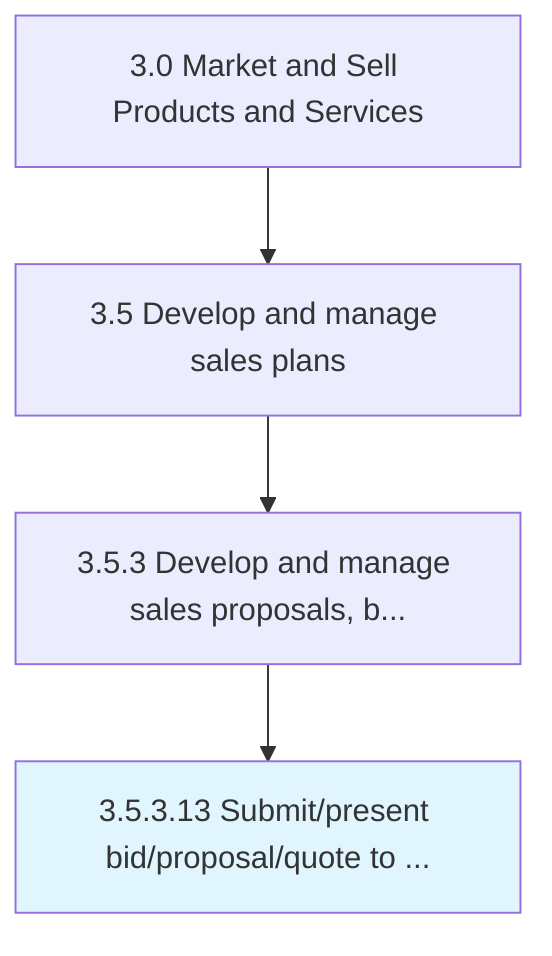

# Submit/present bid/proposal/quote to customer

> Delivering the proposal to the potential client.

## Overview

Activity 3.5.3.13 is an activity within the Market and Sell Products and Services framework. 

## Process Hierarchy



## Key Statistics

| Metric | Value |
|--------|-------|
| APQC Code | 11790 |
| Hierarchy ID | 3.5.3.13 |
| Level | Activity |
| Parent | [3.5.3](../) |
| Sub-Processes | 0 |


## GraphDL Semantic Structure

```
submit/present.Bidproposalquote.to.Customer
```

| Component | Value | Description |
|-----------|-------|-------------|
| Verb | `submit/present` | Primary action |
| Object | `bid/proposal/quote` | Direct object |
| Preposition | `to` | Relationship |
| PrepObject | `customer` | Indirect object |


## Related Concepts

- Bid/Proposal/Quote
- Customer
- Bid/Proposal/Quote
- Customer


---

*Source: APQC PCF 11790 (3.5.3.13) - APQC*
