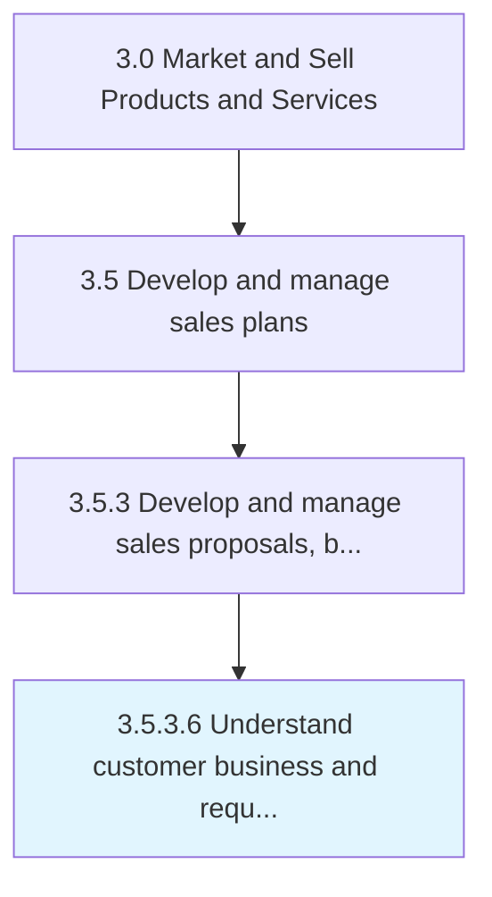

# Understand customer business and requirements

> Deepening knowledge about the customer's field of operation and business needs.

## Overview

Activity 3.5.3.6 is an activity within the Market and Sell Products and Services framework. 

Deepening knowledge about the customer's field of operation and business needs.

## Process Hierarchy



## Key Statistics

| Metric | Value |
|--------|-------|
| APQC Code | 11785 |
| Hierarchy ID | 3.5.3.6 |
| Level | Activity |
| Parent | [3.5.3](../) |
| Sub-Processes | 0 |


## GraphDL Semantic Structure

```
understand.CustomerBusinessAndRequirements
```

| Component | Value | Description |
|-----------|-------|-------------|
| Verb | `understand` | Primary action |
| Object | `customer business and requirements` | Direct object |


## Related Concepts

- [CustomerBusiness](/concepts/CustomerBusiness)
- [Requirements](/concepts/Requirements)


---

*Source: APQC PCF 11785 (3.5.3.6) - APQC*
