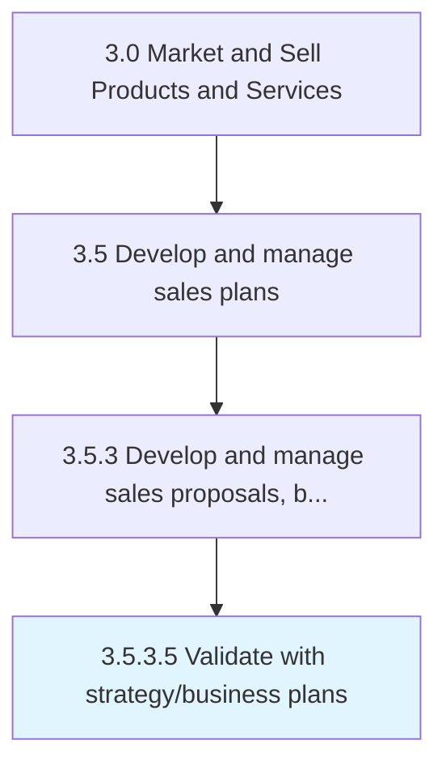

# Validate with strategy/business plans

> Assessing the business strategy, forecasted performance, financing and cash flow of the proposals.

## Overview

Activity 3.5.3.5 is an activity within the Market and Sell Products and Services framework. 

Assessing the business strategy, forecasted performance, financing and cash flow of the proposals.

## Process Hierarchy



## Key Statistics

| Metric | Value |
|--------|-------|
| APQC Code | 11784 |
| Hierarchy ID | 3.5.3.5 |
| Level | Activity |
| Parent | [3.5.3](../) |
| Sub-Processes | 0 |


## GraphDL Semantic Structure

```
validate.WithStrategybusinessPlans
```

| Component | Value | Description |
|-----------|-------|-------------|
| Verb | `validate` | Primary action |
| Object | `with strategy/business plans` | Direct object |


## Related Concepts

- [StrategyPlans](/concepts/StrategyPlans)
- [BusinessPlans](/concepts/BusinessPlans)


---

*Source: APQC PCF 11784 (3.5.3.5) - APQC*
