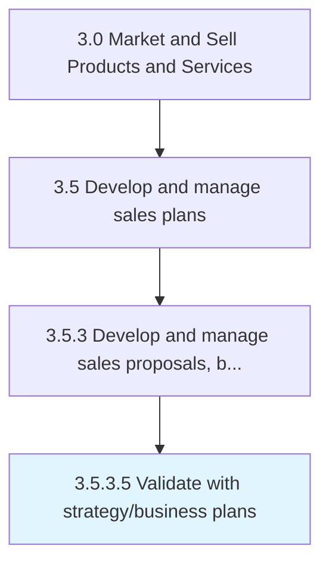

# Validate with strategy/business plans

> Assessing the business strategy, forecasted performance, financing and cash flow of the proposals.

## Overview

Activity 3.5.3.5 is an activity within the Market and Sell Products and Services framework.

Assessing the business strategy, forecasted performance, financing and cash flow of the proposals.

This process is critical to effective sales and marketing execution. It ensures that activities are systematically planned, executed, and measured against organizational objectives. When performed effectively, this process drives revenue growth, enhances customer engagement, and strengthens competitive positioning in target markets.

## Process Hierarchy



## Key Statistics

| Metric | Value |
|--------|-------|
| APQC Code | 11784 |
| Hierarchy ID | 3.5.3.5 |
| Level | Activity |
| Parent | [3.5.3](../) |
| Sub-Processes | 0 |

## Process Flow


## GraphDL Semantic Structure

```
validate.WithStrategybusinessPlans
```

| Component | Value | Description |
|-----------|-------|-------------|
| Verb | `validate` | Primary action |
| Object | `with strategy/business plans` | Direct object |


## RACI Matrix

| Role | Responsible | Accountable | Consulted | Informed |
|------|:-----------:|:-----------:|:---------:|:--------:|
| Sales Representative | R |  |  |  |
| Sales Manager |  | A |  |  |
| Account Manager |  |  | C |  |
| Legal / Contracts |  |  | C |  |
| Executive Leadership |  |  |  | I |

## Related Occupations

- [Sales Managers](/occupations/Management/SalesManagers)
- [Sales Representatives Wholesale And Manufacturing](/occupations/Sales-and-Related/SalesRepresentativesWholesaleAndManufacturing)
- [Account Managers](/occupations/Sales-and-Related/AccountManagers)
- [Customer Service Representatives](/occupations/Office-and-Administrative-Support/CustomerServiceRepresentatives)
- [Business Development Managers](/occupations/Management/BusinessDevelopmentManagers)

## Related Departments

- [Sales](/departments/Sales)
- [Account Management](/departments/AccountManagement)
- [Customer Success](/departments/CustomerSuccess)

## Industry Variations

### Enterprise Software

In enterprise software, validate with strategy/business plans involves complex multi-stakeholder deal cycles, proof-of-concept demonstrations, and contract negotiation with procurement teams.

### Consumer Products

In consumer products, validate with strategy/business plans focuses on trade promotion management, retailer relationship development, and category captainship strategies.

### Professional Services

In professional services, validate with strategy/business plans centers on relationship-based selling, proposal development for complex engagements, and thought leadership positioning.

## KPIs & Metrics

| Metric | Description | Target |
|--------|-------------|--------|
| Win Rate | Percentage of qualified opportunities that result in closed deals | >30% |
| Average Deal Size | Average revenue per closed opportunity | Quarter-over-quarter growth |
| Sales Cycle Length | Average time from lead to closed deal | Below industry average |
| Customer Retention Rate | Percentage of customers retained year-over-year | >90% |

## Related Concepts

- StrategyPlans
- BusinessPlans

---

*Source: APQC PCF 11784 (3.5.3.5) - APQC*
