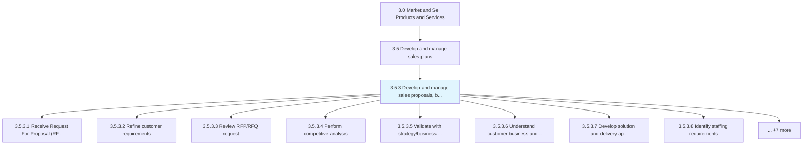
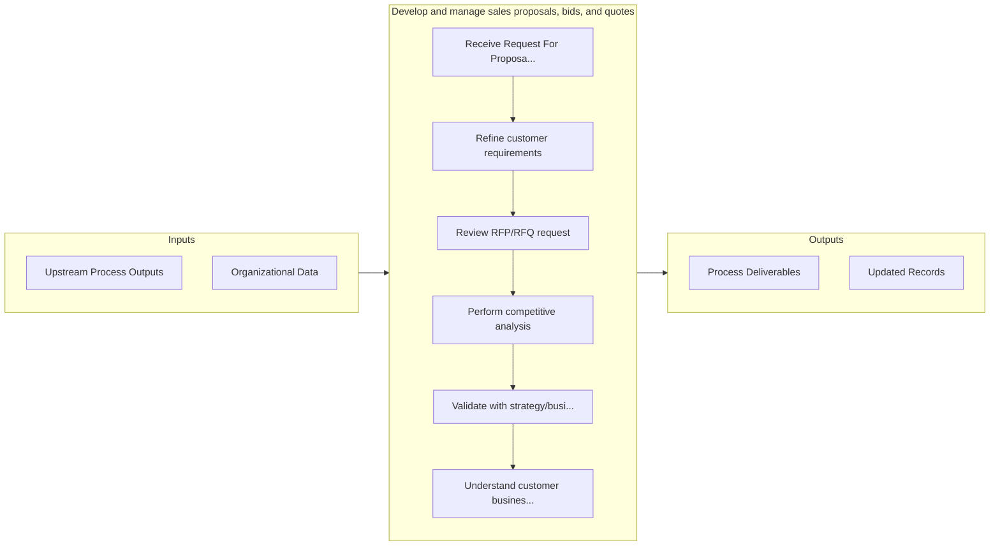

# Develop and manage sales proposals, bids, and quotes

> Understanding and refining the customer requirements as provided in a RFP (Request for Proposal) or RFI (Request for Information).

## Overview

Process 3.5.3 is a core process that defines the specific procedures for develop and manage sales proposals, bids, and quotes. 

Understanding and refining the customer requirements as provided in a RFP (Request for Proposal) or RFI (Request for Information). When compiling the response, they must take into consideration whether the requirements are a match with the strategic or tactical plans of the organization and whether they are able to submit a bid/proposal that is competitive based on an understanding of the offerings of other competing organizations. The next step will be to define the pricing and scheduling of the proposed solution and determine whether the proposal will be profitable for the company if accepted. The bid is then submitted and a notification of whether or not it was successful is received.

## Process Hierarchy



## Key Statistics

| Metric | Value |
|--------|-------|
| APQC Code | 11779 |
| Hierarchy ID | 3.5.3 |
| Level | Process |
| Parent | [3.5](../) |
| Sub-Processes | 15 |


## GraphDL Semantic Structure

```
develop.AndManageSalesProposalsBidsAndQuotes
```

| Component | Value | Description |
|-----------|-------|-------------|
| Verb | `develop` | Primary action |
| Object | `and manage sales proposals, bids, and quotes` | Direct object |


## Process Flow



## Sub-Processes

| Process | Hierarchy ID | Description |
|---------|-------------|-------------|
| [Receive Request For Proposal (RFP)/Request For Quote (RFQ)](./ReceiveRequestForProposalRFPRequestForQuoteRFQ) | 3.5.3.1 | Accepting procurement proposals |
| [Refine customer requirements](./RefineCustomerRequirements) | 3.5.3.2 | Clarifying the details about procurement requests, such as the scope, timeline, data sources, type a |
| [Review RFP/RFQ request](./ReviewRFPRFQRequest) | 3.5.3.3 | Evaluating individual price and delivery solicitations for their strengths and weaknesses |
| [Perform competitive analysis](./PerformCompetitiveAnalysis) | 3.5.3.4 | Comparing the proposals submitted by different bidders in terms of cost, efficiency and value |
| [Validate with strategy/business plans](./ValidateWithStrategybusinessPlans) | 3.5.3.5 | Assessing the business strategy, forecasted performance, financing and cash flow of the proposals |
| [Understand customer business and requirements](./UnderstandCustomerBusinessAndRequirements) | 3.5.3.6 | Deepening knowledge about the customer's field of operation and business needs |
| [Develop solution and delivery approach](./DevelopSolutionAndDeliveryApproach) | 3.5.3.7 | Creating a plan with detailed steps about how produce and deliver the goods or services |
| [Identify staffing requirements](./IdentifyStaffingRequirements) | 3.5.3.8 | Determining the needs for internal resources and vacancies |
| [Develop pricing and scheduling estimates](./DevelopPricingAndSchedulingEstimates) | 3.5.3.9 | Establishing predicted delivery costs, fees and timelines |
| [Conduct profitability analysis](./ConductProfitabilityAnalysis) | 3.5.3.10 | Reviewing profitability data |
| [Manage internal reviews](./ManageInternalReviews) | 3.5.3.11 | Overseeing the internal review process |
| [Manage internal approvals](./ManageInternalApprovals) | 3.5.3.12 | Obtaining required company-internal authorizations |
| [Submit/present bid/proposal/quote to customer](./SubmitpresentBidproposalquoteToCustomer) | 3.5.3.13 | Delivering the proposal to the potential client |
| [Revise bid/proposal/quote](./ReviseBidproposalquote) | 3.5.3.14 | Amending bids, proposals or quotes with more accurate time, cost or delivery estimates |
| [Manage notification outcome](./ManageNotificationOutcome) | 3.5.3.15 | Handling proposals depending on whether they were accepted or rejected |


## Related Concepts

- [SalesProposals](/concepts/SalesProposals)
- [Bids](/concepts/Bids)
- [Quotes](/concepts/Quotes)
- [SalesProposals](/concepts/SalesProposals)
- [Bids](/concepts/Bids)
- [Quotes](/concepts/Quotes)


---

*Source: APQC PCF 11779 (3.5.3) - APQC*
