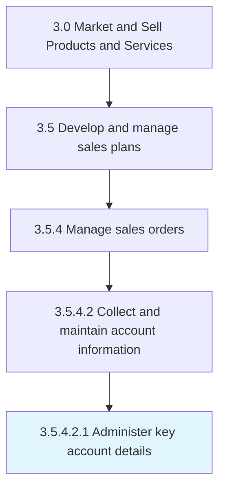

# Administer key account details

> Managing essential information of customer accounts.

## Overview

Sub-Activity 3.5.4.2.1 is an activity within the Market and Sell Products and Services framework. 

Managing essential information of customer accounts.

## Process Hierarchy



## Key Statistics

| Metric | Value |
|--------|-------|
| APQC Code | 10201 |
| Hierarchy ID | 3.5.4.2.1 |
| Level | Sub-Activity |
| Parent | [3.5.4.2](../) |
| Sub-Processes | 0 |


## GraphDL Semantic Structure

```
administer.KeyAccountDetails
```

| Component | Value | Description |
|-----------|-------|-------------|
| Verb | `administer` | Primary action |
| Object | `key account details` | Direct object |


## Related Concepts

- [KeyAccountDetails](/concepts/KeyAccountDetails)


---

*Source: APQC PCF 10201 (3.5.4.2.1) - APQC*
