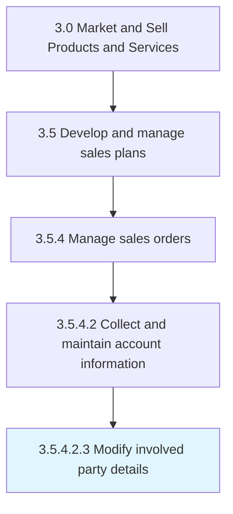

# Modify involved party details

> Altering information about involved parties.

## Overview

Sub-Activity 3.5.4.2.3 is an activity within the Market and Sell Products and Services framework. 

## Process Hierarchy



## Key Statistics

| Metric | Value |
|--------|-------|
| APQC Code | 10203 |
| Hierarchy ID | 3.5.4.2.3 |
| Level | Sub-Activity |
| Parent | [3.5.4.2](../) |
| Sub-Processes | 0 |


## GraphDL Semantic Structure

```
modify.InvolvedPartyDetails
```

| Component | Value | Description |
|-----------|-------|-------------|
| Verb | `modify` | Primary action |
| Object | `involved party details` | Direct object |


## Related Concepts

- InvolvedPartyDetails


---

*Source: APQC PCF 10203 (3.5.4.2.3) - APQC*
