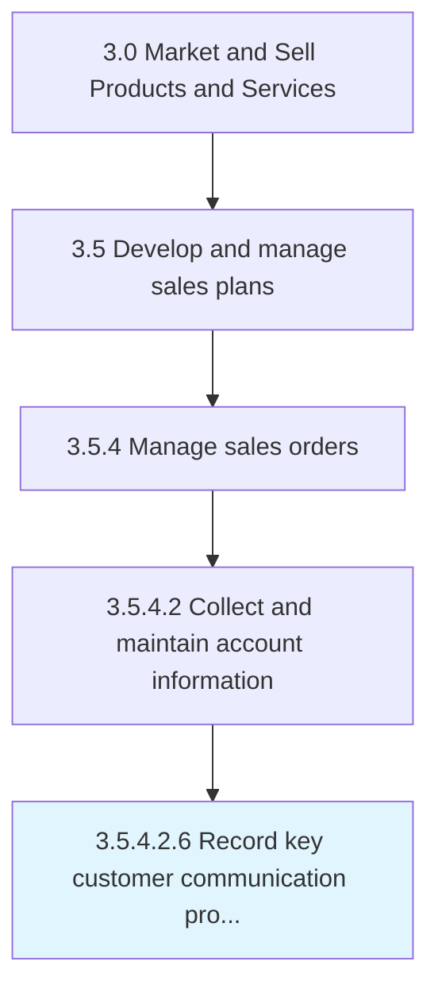

# Record key customer communication profile details

> Providing information about important business rules regarding communicating with customers.

## Overview

Sub-Activity 3.5.4.2.6 is an activity within the Market and Sell Products and Services framework. 

Providing information about important business rules regarding communicating with customers.

## Process Hierarchy



## Key Statistics

| Metric | Value |
|--------|-------|
| APQC Code | 10206 |
| Hierarchy ID | 3.5.4.2.6 |
| Level | Sub-Activity |
| Parent | [3.5.4.2](../) |
| Sub-Processes | 0 |


## GraphDL Semantic Structure

```
record.KeyCustomerCommunicationProfileDetails
```

| Component | Value | Description |
|-----------|-------|-------------|
| Verb | `record` | Primary action |
| Object | `key customer communication profile details` | Direct object |


## Related Concepts

- [KeyCustomerCommunicationProfileDetails](/concepts/KeyCustomerCommunicationProfileDetails)


---

*Source: APQC PCF 10206 (3.5.4.2.6) - APQC*
