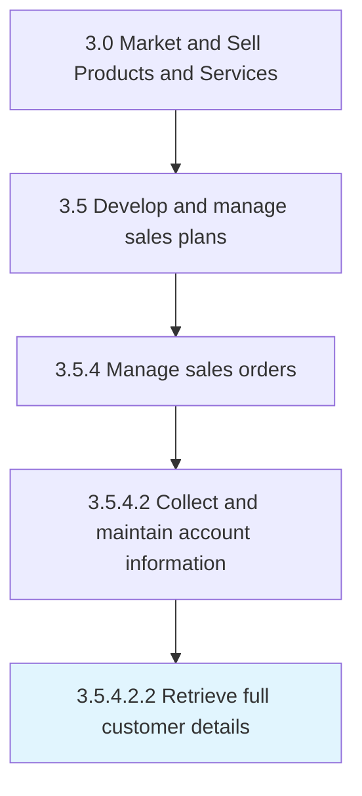

# Retrieve full customer details

> Obtaining detailed information about customers.

## Overview

Sub-Activity 3.5.4.2.2 is an activity within the Market and Sell Products and Services framework. 

## Process Hierarchy



## Key Statistics

| Metric | Value |
|--------|-------|
| APQC Code | 10202 |
| Hierarchy ID | 3.5.4.2.2 |
| Level | Sub-Activity |
| Parent | [3.5.4.2](../) |
| Sub-Processes | 0 |


## GraphDL Semantic Structure

```
retrieve.FullCustomerDetails
```

| Component | Value | Description |
|-----------|-------|-------------|
| Verb | `retrieve` | Primary action |
| Object | `full customer details` | Direct object |


## Related Concepts

- [FullCustomerDetails](/concepts/FullCustomerDetails)


---

*Source: APQC PCF 10202 (3.5.4.2.2) - APQC*
