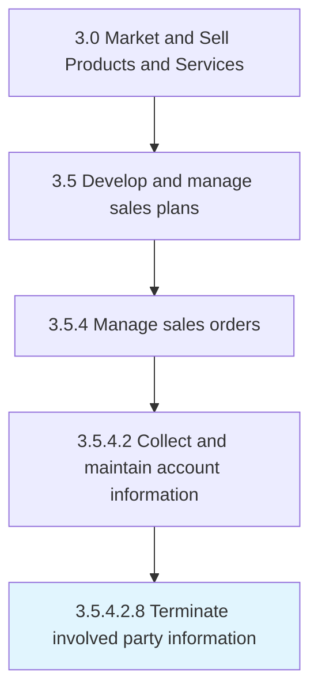

# Terminate involved party information

> Dismissing information about involved parties.

## Overview

Sub-Activity 3.5.4.2.8 is an activity within the Market and Sell Products and Services framework. 

## Process Hierarchy



## Key Statistics

| Metric | Value |
|--------|-------|
| APQC Code | 10208 |
| Hierarchy ID | 3.5.4.2.8 |
| Level | Sub-Activity |
| Parent | [3.5.4.2](../) |
| Sub-Processes | 0 |


## GraphDL Semantic Structure

```
terminate.InvolvedPartyInformation
```

| Component | Value | Description |
|-----------|-------|-------------|
| Verb | `terminate` | Primary action |
| Object | `involved party information` | Direct object |


## Related Concepts

- [InvolvedPartyInformation](/concepts/InvolvedPartyInformation)


---

*Source: APQC PCF 10208 (3.5.4.2.8) - APQC*
