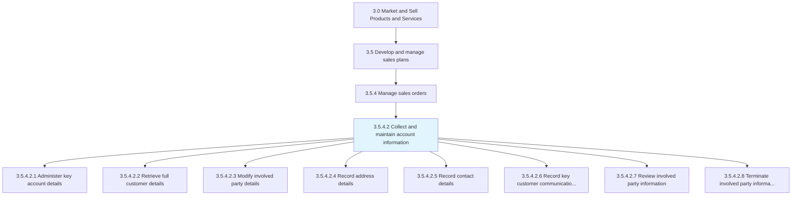
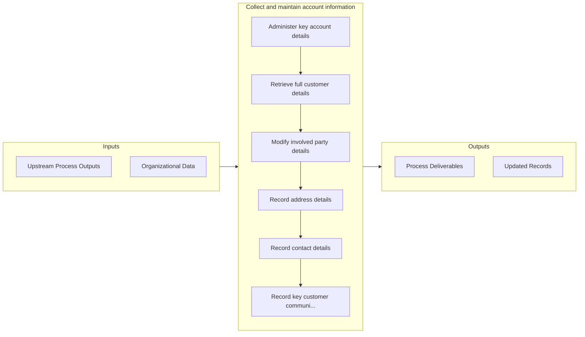

# Collect and maintain account information

> Collecting and maintaining all account information.

## Overview

Activity 3.5.4.2 is an activity within the Market and Sell Products and Services framework. 

Collecting and maintaining all account information. Collect information about the purchase, servicing, return, and/or commitment of any products/services on part of the organization to its customers. Bring together information from various organizational divisions, and update periodically.

## Process Hierarchy



## Key Statistics

| Metric | Value |
|--------|-------|
| APQC Code | 10195 |
| Hierarchy ID | 3.5.4.2 |
| Level | Activity |
| Parent | [3.5.4](../) |
| Sub-Processes | 8 |


## GraphDL Semantic Structure

```graphdl
collect.AndMaintainAccountInformation
```

| Component | Value | Description |
|-----------|-------|-------------|
| Verb | `collect` | Primary action |
| Object | `and maintain account information` | Direct object |


## Process Flow



## Sub-Processes

| Process | Hierarchy ID | Description |
|---------|-------------|-------------|
| [Administer key account details](./AdministerKeyAccountDetails) | 3.5.4.2.1 | Managing essential information of customer accounts |
| [Retrieve full customer details](./RetrieveFullCustomerDetails) | 3.5.4.2.2 | Obtaining detailed information about customers |
| [Modify involved party details](./ModifyInvolvedPartyDetails) | 3.5.4.2.3 | Altering information about involved parties |
| [Record address details](./RecordAddressDetails) | 3.5.4.2.4 | Documenting address information |
| [Record contact details](./RecordContactDetails) | 3.5.4.2.5 | Documenting contact information |
| [Record key customer communication profile details](./RecordKeyCustomerCommunicationProfileDetails) | 3.5.4.2.6 | Providing information about important business rules regarding communicating with customers |
| [Review involved party information](./ReviewInvolvedPartyInformation) | 3.5.4.2.7 | Revising information about involved parties |
| [Terminate involved party information](./TerminateInvolvedPartyInformation) | 3.5.4.2.8 | Dismissing information about involved parties |


## Related Concepts

- AccountInformation
- AccountInformation


---

*Source: APQC PCF 10195 (3.5.4.2) - APQC*
