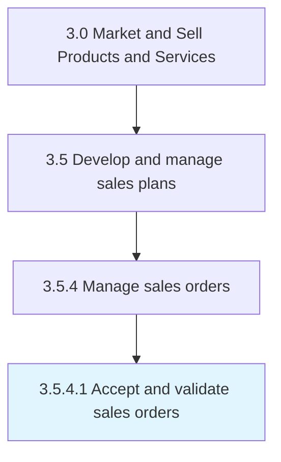

# Accept and validate sales orders

> Receiving and confirming orders from customers.

## Overview

Activity 3.5.4.1 is an activity within the Market and Sell Products and Services framework. 

Receiving and confirming orders from customers. Verify that no extra expenses have to be disbursed on part of the organization for labor or inventory when processing the order.

## Process Hierarchy



## Key Statistics

| Metric | Value |
|--------|-------|
| APQC Code | 10194 |
| Hierarchy ID | 3.5.4.1 |
| Level | Activity |
| Parent | [3.5.4](../) |
| Sub-Processes | 0 |


## GraphDL Semantic Structure

```
accept.AndValidateSalesOrders
```

| Component | Value | Description |
|-----------|-------|-------------|
| Verb | `accept` | Primary action |
| Object | `and validate sales orders` | Direct object |


## Related Concepts

- [SalesOrders](/concepts/SalesOrders)
- [SalesOrders](/concepts/SalesOrders)


---

*Source: APQC PCF 10194 (3.5.4.1) - APQC*
