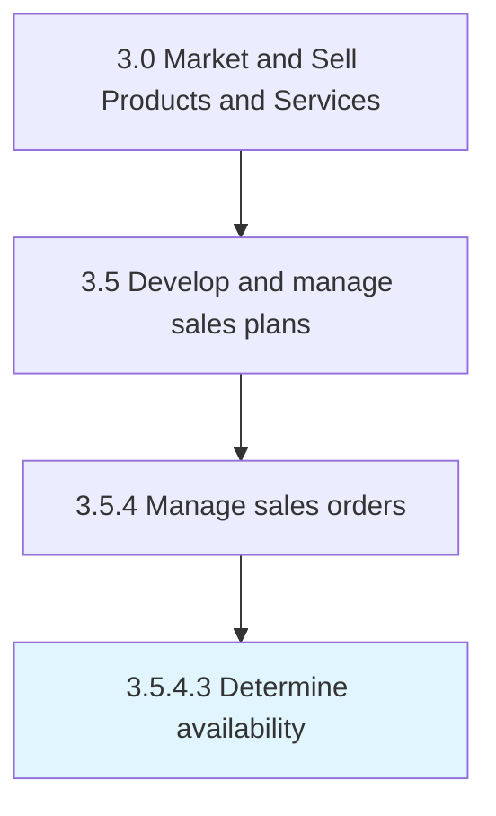

# Determine availability

> Ascertaining the volume or scale of products/services to provide to customers to fulfill sales orders.

## Overview

Activity 3.5.4.3 is an activity within the Market and Sell Products and Services framework. 

Ascertaining the volume or scale of products/services to provide to customers to fulfill sales orders. Check the finished products stored in warehouses, the production capacity, and (in the case of services) the processing speed, as well as work force availability.

## Process Hierarchy



## Key Statistics

| Metric | Value |
|--------|-------|
| APQC Code | 10196 |
| Hierarchy ID | 3.5.4.3 |
| Level | Activity |
| Parent | [3.5.4](../) |
| Sub-Processes | 0 |


## GraphDL Semantic Structure

```
determine.Availability
```

| Component | Value | Description |
|-----------|-------|-------------|
| Verb | `determine` | Primary action |
| Object | `availability` | Direct object |


## Related Concepts

- Availability


---

*Source: APQC PCF 10196 (3.5.4.3) - APQC*
