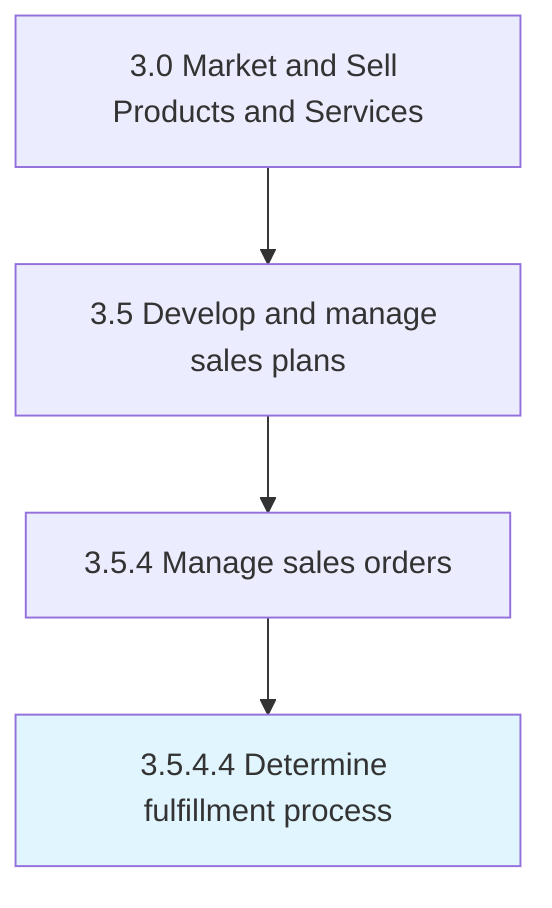

# Determine fulfillment process

> Devising a blueprint for order fulfillment.

## Overview

Activity 3.5.4.4 is an activity within the Market and Sell Products and Services framework. 

Devising a blueprint for order fulfillment. Create a schematic flow encompassing all activities to deliver orders to the customers. Outline a procedure for satisfying these orders by answering questions about what needs to happen in sequence to realize an order.

## Process Hierarchy



## Key Statistics

| Metric | Value |
|--------|-------|
| APQC Code | 10197 |
| Hierarchy ID | 3.5.4.4 |
| Level | Activity |
| Parent | [3.5.4](../) |
| Sub-Processes | 0 |


## GraphDL Semantic Structure

```
determine.FulfillmentProcess
```

| Component | Value | Description |
|-----------|-------|-------------|
| Verb | `determine` | Primary action |
| Object | `fulfillment process` | Direct object |


## Related Concepts

- [FulfillmentProcess](/concepts/FulfillmentProcess)


---

*Source: APQC PCF 10197 (3.5.4.4) - APQC*
