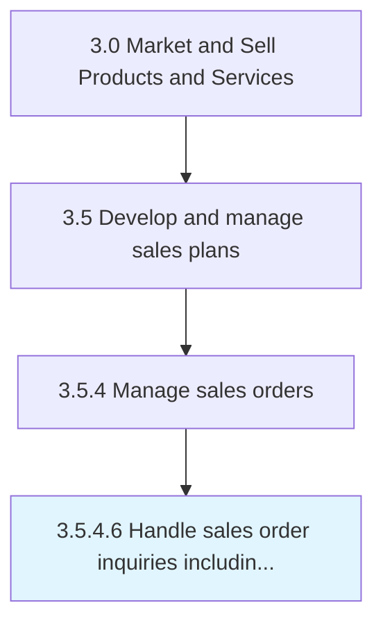

# Handle sales order inquiries including post-order fulfillment transactions

> Attending to any queries received from the customers, even after a sales order has been serviced.

## Overview

Activity 3.5.4.6 is an activity within the Market and Sell Products and Services framework. 

Attending to any queries received from the customers, even after a sales order has been serviced. Deploy ad hoc personnel for managing these enquiries.

## Process Hierarchy



## Key Statistics

| Metric | Value |
|--------|-------|
| APQC Code | 10200 |
| Hierarchy ID | 3.5.4.6 |
| Level | Activity |
| Parent | [3.5.4](../) |
| Sub-Processes | 0 |


## GraphDL Semantic Structure

```
handle.SalesOrderInquiriesIncludingPostorderFulfillmentTransactions
```

| Component | Value | Description |
|-----------|-------|-------------|
| Verb | `handle` | Primary action |
| Object | `sales order inquiries including post-order fulfillment transactions` | Direct object |


---

*Source: APQC PCF 10200 (3.5.4.6) - APQC*
