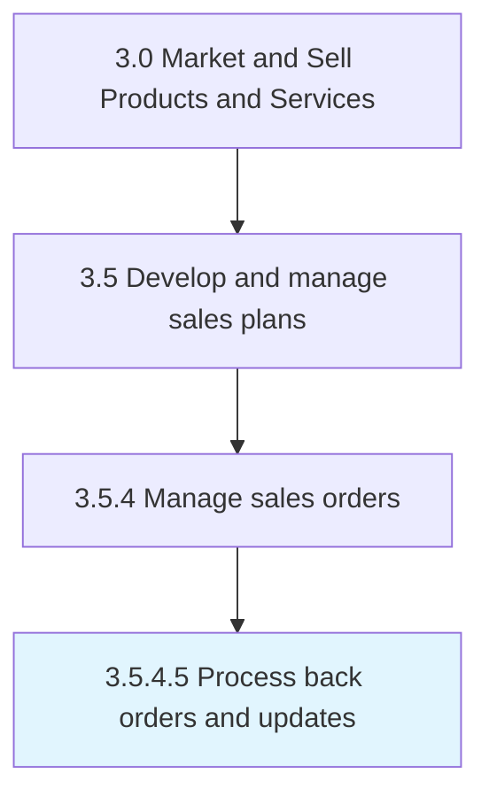

# Process back orders and updates

> Processing any unfulfilled orders, and updating the status of any orders that have been accepted and are being attended to.

## Overview

Activity 3.5.4.5 is an activity within the Market and Sell Products and Services framework. 

Processing any unfulfilled orders, and updating the status of any orders that have been accepted and are being attended to. Deliver on any purchase orders that remain unserviced due to temporary unavailability of the product/service. Manage any updates to the sales orders. Revise their status in the order system.

## Process Hierarchy



## Key Statistics

| Metric | Value |
|--------|-------|
| APQC Code | 10199 |
| Hierarchy ID | 3.5.4.5 |
| Level | Activity |
| Parent | [3.5.4](../) |
| Sub-Processes | 0 |


## GraphDL Semantic Structure

```
process.BackOrdersAndUpdates
```

| Component | Value | Description |
|-----------|-------|-------------|
| Verb | `process` | Primary action |
| Object | `back orders and updates` | Direct object |


## Related Concepts

- BackOrders
- Updates


---

*Source: APQC PCF 10199 (3.5.4.5) - APQC*
