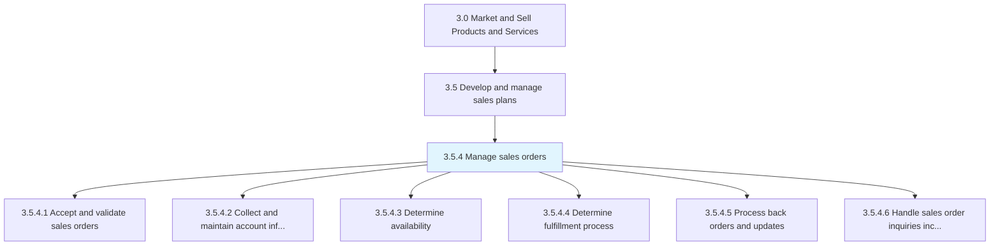
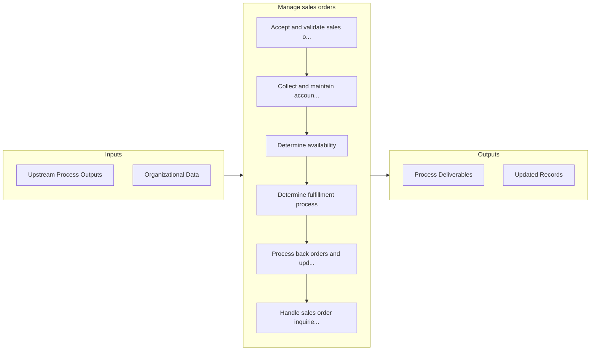

# Manage sales orders

> Taking, receiving, processing, and acknowledging new customer orders or amendments to outstanding customer orders.

## Overview

Process 3.5.4 is a core process that defines the specific procedures for manage sales orders. 

Taking, receiving, processing, and acknowledging new customer orders or amendments to outstanding customer orders. Monitoring status from order receipt to customer delivery/customer invoicing.

## Process Hierarchy



## Key Statistics

| Metric | Value |
|--------|-------|
| APQC Code | 10185 |
| Hierarchy ID | 3.5.4 |
| Level | Process |
| Parent | [3.5](../) |
| Sub-Processes | 6 |


## GraphDL Semantic Structure

```
manage.SalesOrders
```

| Component | Value | Description |
|-----------|-------|-------------|
| Verb | `manage` | Primary action |
| Object | `sales orders` | Direct object |


## Process Flow



## Sub-Processes

| Process | Hierarchy ID | Description |
|---------|-------------|-------------|
| [Accept and validate sales orders](./AcceptAndValidateSalesOrders) | 3.5.4.1 | Receiving and confirming orders from customers |
| [Collect and maintain account information](./3.5.4.2-CollectMaintainAccountInformation/) | 3.5.4.2 | Collecting and maintaining all account information |
| [Determine availability](./DetermineAvailability) | 3.5.4.3 | Ascertaining the volume or scale of products/services to provide to customers to fulfill sales order |
| [Determine fulfillment process](./DetermineFulfillmentProcess) | 3.5.4.4 | Devising a blueprint for order fulfillment |
| [Process back orders and updates](./ProcessBackOrdersAndUpdates) | 3.5.4.5 | Processing any unfulfilled orders, and updating the status of any orders that have been accepted and |
| [Handle sales order inquiries including post-order fulfillment transactions](./HandleSalesOrderInquiriesIncludingPostorderFulfillmentTransactions) | 3.5.4.6 | Attending to any queries received from the customers, even after a sales order has been serviced |


## Related Concepts

- [SalesOrders](/concepts/SalesOrders)


---

*Source: APQC PCF 10185 (3.5.4) - APQC*
