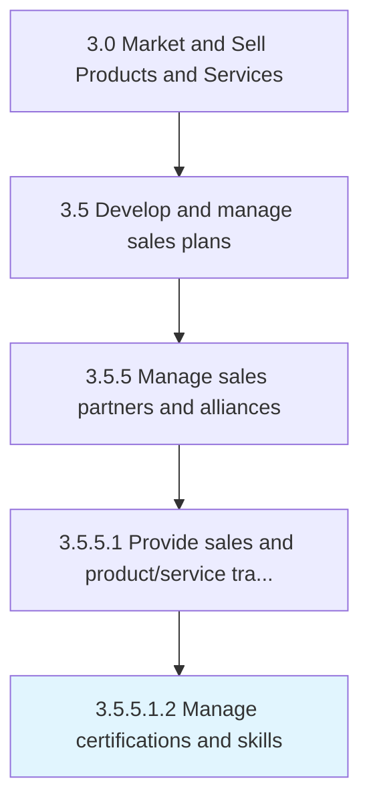

# Manage certifications and skills

> Reviewing, processing and issuing certifications and accrediting skills and competencies.

## Overview

Sub-Activity 3.5.5.1.2 is an activity within the Market and Sell Products and Services framework. 

Reviewing, processing and issuing certifications and accrediting skills and competencies.

## Process Hierarchy



## Key Statistics

| Metric | Value |
|--------|-------|
| APQC Code | 20020 |
| Hierarchy ID | 3.5.5.1.2 |
| Level | Sub-Activity |
| Parent | [3.5.5.1](../) |
| Sub-Processes | 0 |


## GraphDL Semantic Structure

```
manage.CertificationsAndSkills
```

| Component | Value | Description |
|-----------|-------|-------------|
| Verb | `manage` | Primary action |
| Object | `certifications and skills` | Direct object |


## Related Concepts

- Certifications
- Skills


---

*Source: APQC PCF 20020 (3.5.5.1.2) - APQC*
