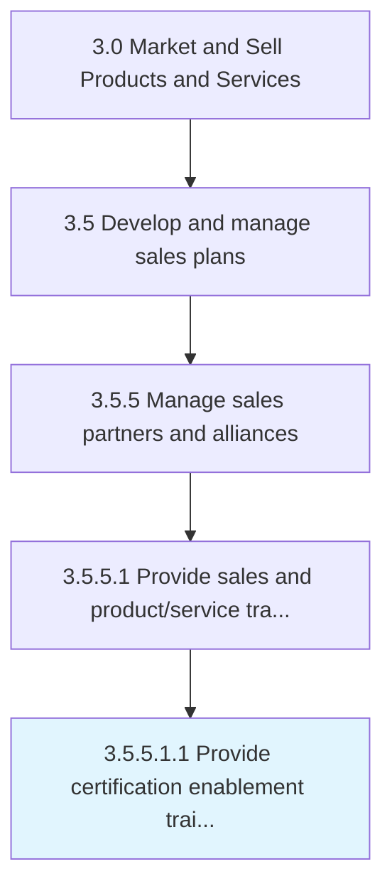

# Provide certification enablement training

> Provide training and certification to develop strategies for marketing-driven sales.

## Overview

Sub-Activity 3.5.5.1.1 is an activity within the Market and Sell Products and Services framework. 

Provide training and certification to develop strategies for marketing-driven sales.

## Process Hierarchy



## Key Statistics

| Metric | Value |
|--------|-------|
| APQC Code | 20019 |
| Hierarchy ID | 3.5.5.1.1 |
| Level | Sub-Activity |
| Parent | [3.5.5.1](../) |
| Sub-Processes | 0 |


## GraphDL Semantic Structure

```
provide.CertificationEnablementTraining
```

| Component | Value | Description |
|-----------|-------|-------------|
| Verb | `provide` | Primary action |
| Object | `certification enablement training` | Direct object |


## Related Concepts

- CertificationEnablementTraining


---

*Source: APQC PCF 20019 (3.5.5.1.1) - APQC*
