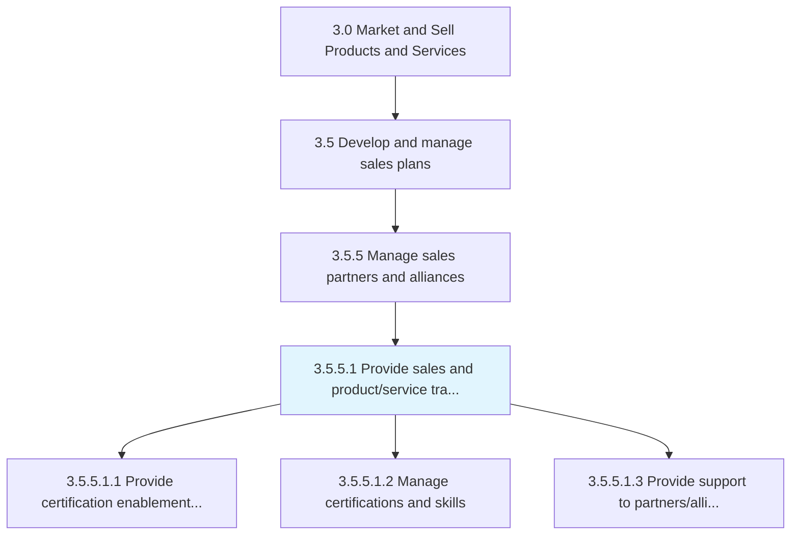
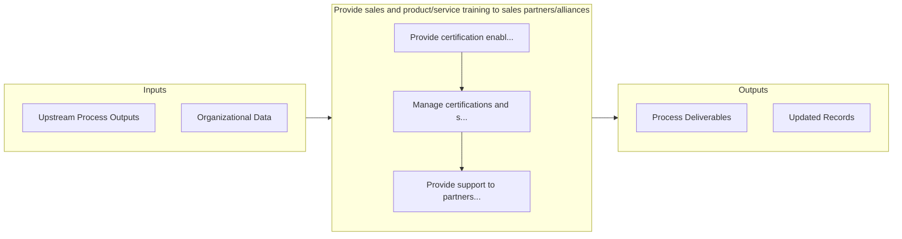

# Provide sales and product/service training to sales partners/alliances

> Imparting guidance and instruction to sales partners/alliances concerning products/services.

## Overview

Activity 3.5.5.1 is an activity within the Market and Sell Products and Services framework. 

Imparting guidance and instruction to sales partners/alliances concerning products/services. Distribute literature about the organization's products/services. Conduct workshops. Disseminate useful media content to engage and enlighten partners. Create communities through group engagements.

## Process Hierarchy



## Key Statistics

| Metric | Value |
|--------|-------|
| APQC Code | 10211 |
| Hierarchy ID | 3.5.5.1 |
| Level | Activity |
| Parent | [3.5.5](../) |
| Sub-Processes | 3 |


## GraphDL Semantic Structure

```
provide.SalesAndProductserviceTraining.to.SalesPartnersalliances
```

| Component | Value | Description |
|-----------|-------|-------------|
| Verb | `provide` | Primary action |
| Object | `sales and product/service training` | Direct object |
| Preposition | `to` | Relationship |
| PrepObject | `sales partners/alliances` | Indirect object |


## Process Flow



## Sub-Processes

| Process | Hierarchy ID | Description |
|---------|-------------|-------------|
| [Provide certification enablement training](./ProvideCertificationEnablementTraining) | 3.5.5.1.1 | Provide training and certification to develop strategies for marketing-driven sales |
| [Manage certifications and skills](./ManageCertificationsAndSkills) | 3.5.5.1.2 | Reviewing, processing and issuing certifications and accrediting skills and competencies |
| [Provide support to partners/alliances](./ProvideSupportToPartnersalliances) | 3.5.5.1.3 | Backing sales partners and strategic alliances |


## Related Concepts

- Sales
- SalesPartners
- Sales
- SalesAlliances
- ProductTraining
- SalesPartners
- ProductTraining
- SalesAlliances
- ServiceTraining
- SalesPartners


---

*Source: APQC PCF 10211 (3.5.5.1) - APQC*
